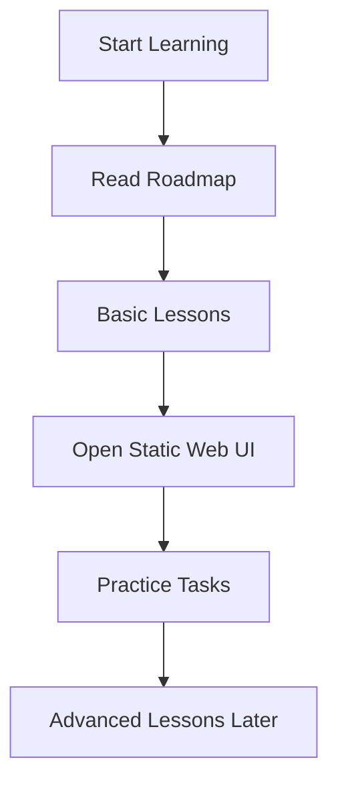

# ASP.NET Core Web API .NET 10 Documentation Project

## Project Goal
Build a complete learning documentation website for **ASP.NET Core Web API using .NET 10**. This repository is for learning materials only.

বাংলা সারাংশ: এই প্রজেক্টটি ASP.NET Core Web API শেখার জন্য documentation এবং static website; এটি backend API application নয়।

## What This Project Contains
- Markdown lessons inside the `docs/` folder.
- A static documentation website inside the `web/` folder.
- Beginner-friendly explanations, Bangla summaries, code examples, diagrams, and practice tasks.
- A step-by-step roadmap from basic to advanced ASP.NET Core Web API concepts.

বাংলা সারাংশ: এই প্রজেক্টটি ASP.NET Core Web API শেখার জন্য documentation এবং static website; এটি backend API application নয়।

## What This Project Does Not Contain
- No running ASP.NET Core backend project.
- No database setup files.
- No API controllers as a real application.
- No compiled `.NET` source project.

বাংলা সারাংশ: এই প্রজেক্টটি ASP.NET Core Web API শেখার জন্য documentation এবং static website; এটি backend API application নয়।

## Folder Structure
```text
docs/
  01-basic/
  02-intermediate/
  03-advanced/
  04-architecture/
  05-real-world-project/
  06-interview/
  07-cheatsheets/
web/
  index.html
  assets/
    css/
      style.css
    js/
      app.js
```

## Recommended Learning Flow
1. Start with `learning-roadmap.md`.
2. Read `docs/01-basic/lesson-01-what-is-aspnet-core-web-api.md`.
3. Read `docs/01-basic/lesson-02-http-rest-json.md`.
4. Open `web/index.html` in a browser.
5. Continue adding lessons step by step.

বাংলা সারাংশ: এই প্রজেক্টটি ASP.NET Core Web API শেখার জন্য documentation এবং static website; এটি backend API application নয়।

## .NET 10 Example Style
The code snippets use modern ASP.NET Core minimal hosting style from .NET 10.

```csharp
var builder = WebApplication.CreateBuilder(args);

builder.Services.AddControllers();
builder.Services.AddOpenApi();

var app = builder.Build();

app.MapControllers();
app.Run();
```

বাংলা সারাংশ: এই প্রজেক্টটি ASP.NET Core Web API শেখার জন্য documentation এবং static website; এটি backend API application নয়।

## Mermaid Project Flow


## Practice Task
Open this project folder and explain the difference between a documentation website and a backend API project in your own words.
