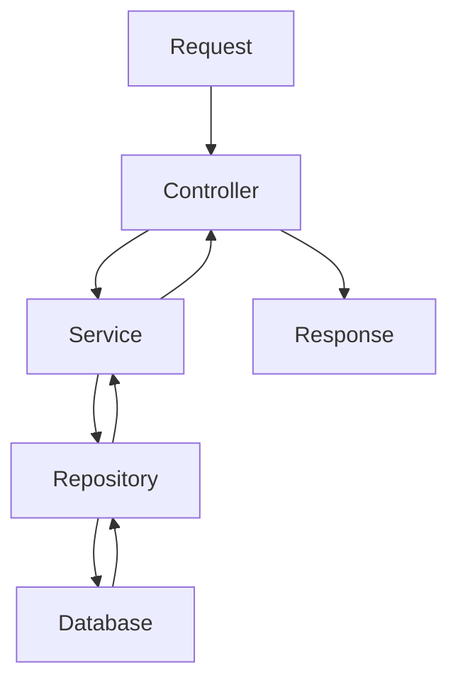

# ASP.NET Core Web API Cheatsheet

## Learning Goal
Quickly recall common ASP.NET Core Web API syntax, commands, and design decisions.

## Simple Explanation
A cheatsheet is a fast reference. Use it while building or revising, but learn the reason behind every command.

বাংলা সারাংশ: দ্রুত মনে করার জন্য এই চিটশিট, কিন্তু প্রতিটি কমান্ডের কারণ বুঝে ব্যবহার করুন।

## Real-world Example
When creating Employee endpoints, use this file to quickly remember status codes, DI registration, EF Core commands, and JWT setup areas.

## Code Example
```bash
dotnet new webapi -n Employee.Api
dotnet add package Microsoft.EntityFrameworkCore.SqlServer
dotnet ef migrations add InitialCreate
dotnet ef database update
```

## Common Mistakes
- Running migrations without reviewing generated changes.
- Returning entity classes directly.
- Forgetting `await` on async database calls.
- Registering services with the wrong lifetime.

## Best Practices
- `Scoped`: DbContext, repositories, services.
- `Singleton`: stateless shared services only.
- `Transient`: lightweight short-lived services.
- Use `AsNoTracking()` for read-only EF Core queries.
- Use `CreatedAtAction` for successful create operations.

## Practice Task
Build a one-page personal cheatsheet with commands, status codes, middleware order, and folder structure.

## Quick Reference
- `GET`: read data.
- `POST`: create data.
- `PUT`: replace/update data.
- `PATCH`: partial update.
- `DELETE`: remove data.
- `400`: validation error.
- `401`: unauthenticated.
- `403`: forbidden.
- `404`: not found.
- `500`: server error.

## Mermaid Diagram

