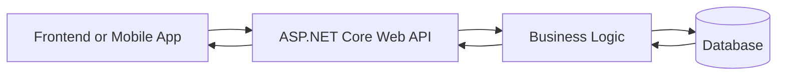

# Lesson 01: What is ASP.NET Core Web API?

## Learning Goal
Understand what ASP.NET Core Web API is, why developers use it, and how it connects frontend applications with backend logic and data.

বাংলা সারাংশ: এই অংশটি সহজভাবে মূল ধারণা, বাস্তব ব্যবহার এবং অনুশীলন বুঝতে সাহায্য করবে।

## Simple Explanation
ASP.NET Core Web API is a framework for building HTTP services using C# and .NET. A Web API receives requests from clients, runs business logic, and returns data, usually as JSON.

A client can be:
- A React, Angular, Vue, or Blazor frontend.
- A mobile app.
- A desktop app.
- Another backend service.

বাংলা সারাংশ: এই অংশটি সহজভাবে মূল ধারণা, বাস্তব ব্যবহার এবং অনুশীলন বুঝতে সাহায্য করবে।

## Real-world Example
Imagine an Employee Management system. The frontend needs employee data. Instead of connecting directly to the database, the frontend calls an API:

```http
GET /api/employees/1
```

The API returns:

```json
{
  "id": 1,
  "name": "Rahim Uddin",
  "department": "HR"
}
```

বাংলা সারাংশ: এই অংশটি সহজভাবে মূল ধারণা, বাস্তব ব্যবহার এবং অনুশীলন বুঝতে সাহায্য করবে।

## .NET 10 Code Example
This is a small .NET 10 style Web API example:

```csharp
var builder = WebApplication.CreateBuilder(args);

builder.Services.AddControllers();
builder.Services.AddOpenApi();

var app = builder.Build();

app.MapGet("/api/hello", () => new
{
    Message = "Hello from ASP.NET Core Web API",
    Framework = ".NET 10"
});

app.Run();
```

বাংলা সারাংশ: এই অংশটি সহজভাবে মূল ধারণা, বাস্তব ব্যবহার এবং অনুশীলন বুঝতে সাহায্য করবে।

## Why Web API is Important
- It separates frontend and backend work.
- It allows multiple clients to use the same backend.
- It supports JSON, HTTP, authentication, logging, validation, and deployment.
- It is commonly used in modern enterprise applications.

বাংলা সারাংশ: এই অংশটি সহজভাবে মূল ধারণা, বাস্তব ব্যবহার এবং অনুশীলন বুঝতে সাহায্য করবে।

## Common Mistakes
- Thinking Web API is the same as a full website.
- Returning database entities directly from API responses.
- Writing all business logic inside controllers.
- Ignoring HTTP status codes.

বাংলা সারাংশ: এই অংশটি সহজভাবে মূল ধারণা, বাস্তব ব্যবহার এবং অনুশীলন বুঝতে সাহায্য করবে।

## Best Practices
- Keep controllers small.
- Use DTOs for request and response.
- Return proper status codes.
- Keep business logic in services.
- Use Swagger/OpenAPI for documentation.

বাংলা সারাংশ: এই অংশটি সহজভাবে মূল ধারণা, বাস্তব ব্যবহার এবং অনুশীলন বুঝতে সাহায্য করবে।

## Mermaid Diagram


## Practice Task
Write three examples of applications that can use a Web API. Then write one possible API endpoint for each example.
