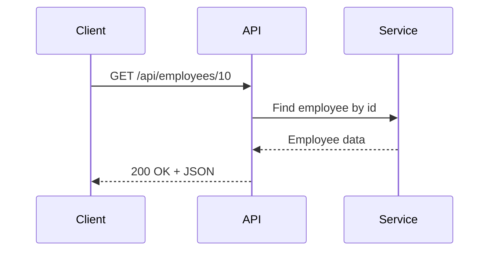

# Lesson 02: HTTP, REST API, and JSON

## Learning Goal
Understand how HTTP, REST, and JSON work together in ASP.NET Core Web API development.

বাংলা সারাংশ: এই অংশটি সহজভাবে মূল ধারণা, বাস্তব ব্যবহার এবং অনুশীলন বুঝতে সাহায্য করবে।

## What is HTTP?
HTTP means Hypertext Transfer Protocol. It is the communication protocol used by browsers, mobile apps, and APIs to send requests and receive responses.

Common HTTP methods:
- `GET`: read data.
- `POST`: create data.
- `PUT`: update or replace data.
- `PATCH`: partially update data.
- `DELETE`: remove data.

বাংলা সারাংশ: এই অংশটি সহজভাবে মূল ধারণা, বাস্তব ব্যবহার এবং অনুশীলন বুঝতে সাহায্য করবে।

## What is REST API?
REST is an API design style. In REST, resources are represented by URLs, and HTTP methods describe the action.

Example resource: `employees`

```http
GET    /api/employees
GET    /api/employees/10
POST   /api/employees
PUT    /api/employees/10
DELETE /api/employees/10
```

বাংলা সারাংশ: এই অংশটি সহজভাবে মূল ধারণা, বাস্তব ব্যবহার এবং অনুশীলন বুঝতে সাহায্য করবে।

## What is JSON?
JSON means JavaScript Object Notation. It is a lightweight data format used by most APIs.

Example JSON response:

```json
{
  "id": 10,
  "name": "Nusrat Jahan",
  "role": "Software Engineer",
  "isActive": true
}
```

বাংলা সারাংশ: এই অংশটি সহজভাবে মূল ধারণা, বাস্তব ব্যবহার এবং অনুশীলন বুঝতে সাহায্য করবে।

## .NET 10 Code Example
```csharp
var builder = WebApplication.CreateBuilder(args);
var app = builder.Build();

var employees = new[]
{
    new { Id = 1, Name = "Rahim", Department = "HR" },
    new { Id = 2, Name = "Karim", Department = "IT" }
};

app.MapGet("/api/employees", () => Results.Ok(employees));

app.MapGet("/api/employees/{id:int}", (int id) =>
{
    var employee = employees.FirstOrDefault(x => x.Id == id);
    return employee is null ? Results.NotFound() : Results.Ok(employee);
});

app.Run();
```

বাংলা সারাংশ: এই অংশটি সহজভাবে মূল ধারণা, বাস্তব ব্যবহার এবং অনুশীলন বুঝতে সাহায্য করবে।

## HTTP Status Codes
- `200 OK`: request successful.
- `201 Created`: new resource created.
- `400 Bad Request`: invalid request.
- `401 Unauthorized`: login required.
- `403 Forbidden`: permission missing.
- `404 Not Found`: resource not found.
- `500 Internal Server Error`: server error.

বাংলা সারাংশ: এই অংশটি সহজভাবে মূল ধারণা, বাস্তব ব্যবহার এবং অনুশীলন বুঝতে সাহায্য করবে।

## Common Mistakes
- Using `POST` for every operation.
- Returning `200 OK` for errors.
- Designing URLs with verbs like `/getEmployees` instead of resource names like `/employees`.
- Sending inconsistent JSON property names.

বাংলা সারাংশ: এই অংশটি সহজভাবে মূল ধারণা, বাস্তব ব্যবহার এবং অনুশীলন বুঝতে সাহায্য করবে।

## Best Practices
- Use nouns in URLs: `/api/employees`.
- Use correct HTTP methods.
- Return correct status codes.
- Keep JSON response names consistent.
- Use pagination for large lists.

বাংলা সারাংশ: এই অংশটি সহজভাবে মূল ধারণা, বাস্তব ব্যবহার এবং অনুশীলন বুঝতে সাহায্য করবে।

## Mermaid Diagram


## Practice Task
Design REST endpoints for a `Department` resource. Include `GET`, `POST`, `PUT`, and `DELETE` examples.
