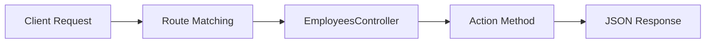

# Lesson 03: Controller, Route, and Action Method

## Learning Goal
Learn how controllers group related API endpoints, how routes define URLs, and how action methods handle HTTP requests.

বাংলা সারাংশ: এই অংশে আপনি পাঠের মূল লক্ষ্য বুঝবেন।

## Beginner-friendly Explanation
In ASP.NET Core Web API, a controller is a C# class that receives HTTP requests. A route tells ASP.NET Core which URL should go to which controller or action method. An action method is a public method that runs when a matching request arrives.

বাংলা সারাংশ: ধারণাটি সহজভাবে বুঝে নিন, তারপর ছোট উদাহরণ দিয়ে অনুশীলন করুন।

## Real-world Example
In an Employee Management API, `EmployeesController` can contain endpoints such as `GET /api/employees`, `GET /api/employees/5`, and `POST /api/employees`.

বাংলা সারাংশ: বাস্তব প্রজেক্টে এই ধারণাটি কীভাবে কাজ করে তা লক্ষ্য করুন।

## ASP.NET Core Web API .NET 10 Code Example
```csharp
using Microsoft.AspNetCore.Mvc;

namespace EmployeeDocs.Api.Controllers;

[ApiController]
[Route("api/[controller]")]
public sealed class EmployeesController : ControllerBase
{
    [HttpGet]
    public IActionResult GetAll()
    {
        var employees = new[]
        {
            new { Id = 1, Name = "Rahim", Department = "HR" },
            new { Id = 2, Name = "Nusrat", Department = "IT" }
        };

        return Ok(employees);
    }

    [HttpGet("{id:int}")]
    public IActionResult GetById(int id)
    {
        return Ok(new { Id = id, Name = "Sample Employee" });
    }
}
```

বাংলা সারাংশ: কোডটি .NET 10 স্টাইলে লেখা এবং শেখার জন্য সহজ করে দেখানো হয়েছে।

## Mermaid Diagram


## Common Mistakes
- Forgetting `[ApiController]` on API controllers.
- Creating unclear routes like `/api/getEmployees` instead of resource-based routes.
- Putting too much business logic inside action methods.

বাংলা সারাংশ: এই ভুলগুলো এড়িয়ে চললে আপনার API আরও পরিষ্কার হবে।

## Best Practices
- Use clear resource names such as `/api/employees`.
- Keep action methods short and readable.
- Move business rules into services as the app grows.

বাংলা সারাংশ: ভাল অভ্যাস মেনে চললে code পড়া, test করা এবং maintain করা সহজ হয়।

## Practice Task
Create a `DepartmentsController` with `GET /api/departments` and `GET /api/departments/{id}` action examples.

বাংলা সারাংশ: নিজে ছোট একটি উদাহরণ তৈরি করলে ধারণাটি ভালভাবে মনে থাকবে।
