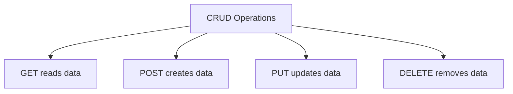

# Lesson 04: GET, POST, PUT, and DELETE

## Learning Goal
Understand the four most common HTTP methods used to build CRUD endpoints in Web API.

বাংলা সারাংশ: এই অংশে আপনি পাঠের মূল লক্ষ্য বুঝবেন।

## Beginner-friendly Explanation
`GET` reads data, `POST` creates data, `PUT` updates or replaces data, and `DELETE` removes data. These methods help clients understand the purpose of each API request.

বাংলা সারাংশ: ধারণাটি সহজভাবে বুঝে নিন, তারপর ছোট উদাহরণ দিয়ে অনুশীলন করুন।

## Real-world Example
For employees, use `GET /api/employees` to list employees, `POST /api/employees` to create one, `PUT /api/employees/5` to update one, and `DELETE /api/employees/5` to remove one.

বাংলা সারাংশ: বাস্তব প্রজেক্টে এই ধারণাটি কীভাবে কাজ করে তা লক্ষ্য করুন।

## ASP.NET Core Web API .NET 10 Code Example
```csharp
using Microsoft.AspNetCore.Mvc;

[ApiController]
[Route("api/[controller]")]
public sealed class EmployeesController : ControllerBase
{
    [HttpGet]
    public IActionResult GetAll() => Ok(new[] { "Rahim", "Nusrat" });

    [HttpPost]
    public IActionResult Create(CreateEmployeeRequest request)
    {
        var response = new { Id = 10, request.Name, request.Department };
        return CreatedAtAction(nameof(GetAll), response);
    }

    [HttpPut("{id:int}")]
    public IActionResult Update(int id, UpdateEmployeeRequest request)
    {
        return Ok(new { Id = id, request.Name, request.Department });
    }

    [HttpDelete("{id:int}")]
    public IActionResult Delete(int id) => NoContent();
}

public sealed record CreateEmployeeRequest(string Name, string Department);
public sealed record UpdateEmployeeRequest(string Name, string Department);
```

বাংলা সারাংশ: কোডটি .NET 10 স্টাইলে লেখা এবং শেখার জন্য সহজ করে দেখানো হয়েছে।

## Mermaid Diagram


## Common Mistakes
- Using `POST` for every operation.
- Returning `200 OK` after delete when `204 No Content` is clearer.
- Not using route parameters for resource IDs.

বাংলা সারাংশ: এই ভুলগুলো এড়িয়ে চললে আপনার API আরও পরিষ্কার হবে।

## Best Practices
- Use the HTTP method that matches the action.
- Return `201 Created` when a resource is created.
- Return `404 Not Found` when the target resource does not exist.

বাংলা সারাংশ: ভাল অভ্যাস মেনে চললে code পড়া, test করা এবং maintain করা সহজ হয়।

## Practice Task
Write CRUD endpoints for a `Department` resource using GET, POST, PUT, and DELETE.

বাংলা সারাংশ: নিজে ছোট একটি উদাহরণ তৈরি করলে ধারণাটি ভালভাবে মনে থাকবে।
