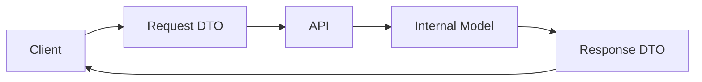

# Lesson 05: Model, DTO, Request, and Response

## Learning Goal
Learn the difference between internal data models and public API request/response DTOs.

বাংলা সারাংশ: এই অংশে আপনি পাঠের মূল লক্ষ্য বুঝবেন।

## Beginner-friendly Explanation
A model usually represents internal data or database shape. A DTO is a Data Transfer Object used at the API boundary. Request DTOs describe what clients send. Response DTOs describe what the API returns.

বাংলা সারাংশ: ধারণাটি সহজভাবে বুঝে নিন, তারপর ছোট উদাহরণ দিয়ে অনুশীলন করুন।

## Real-world Example
An `Employee` model may contain `PasswordHash` or audit fields, but `EmployeeResponse` should only return safe fields such as `Id`, `Name`, and `DepartmentName`.

বাংলা সারাংশ: বাস্তব প্রজেক্টে এই ধারণাটি কীভাবে কাজ করে তা লক্ষ্য করুন।

## ASP.NET Core Web API .NET 10 Code Example
```csharp
public sealed class Employee
{
    public int Id { get; set; }
    public string Name { get; set; } = string.Empty;
    public string Department { get; set; } = string.Empty;
    public DateTime CreatedAtUtc { get; set; }
}

public sealed record CreateEmployeeRequest(string Name, string Department);

public sealed record EmployeeResponse(int Id, string Name, string Department);

app.MapPost("/api/employees", (CreateEmployeeRequest request) =>
{
    var employee = new Employee
    {
        Id = 1,
        Name = request.Name,
        Department = request.Department,
        CreatedAtUtc = DateTime.UtcNow
    };

    var response = new EmployeeResponse(employee.Id, employee.Name, employee.Department);
    return Results.Created($"/api/employees/{employee.Id}", response);
});
```

বাংলা সারাংশ: কোডটি .NET 10 স্টাইলে লেখা এবং শেখার জন্য সহজ করে দেখানো হয়েছে।

## Mermaid Diagram


## Common Mistakes
- Returning database models directly from endpoints.
- Using one DTO for create, update, and response even when fields differ.
- Including sensitive fields in response DTOs.

বাংলা সারাংশ: এই ভুলগুলো এড়িয়ে চললে আপনার API আরও পরিষ্কার হবে।

## Best Practices
- Use separate request and response DTOs.
- Keep DTO names clear and purpose-based.
- Return only fields that the client needs.

বাংলা সারাংশ: ভাল অভ্যাস মেনে চললে code পড়া, test করা এবং maintain করা সহজ হয়।

## Practice Task
Create `CreateDepartmentRequest` and `DepartmentResponse` DTO examples.

বাংলা সারাংশ: নিজে ছোট একটি উদাহরণ তৈরি করলে ধারণাটি ভালভাবে মনে থাকবে।
