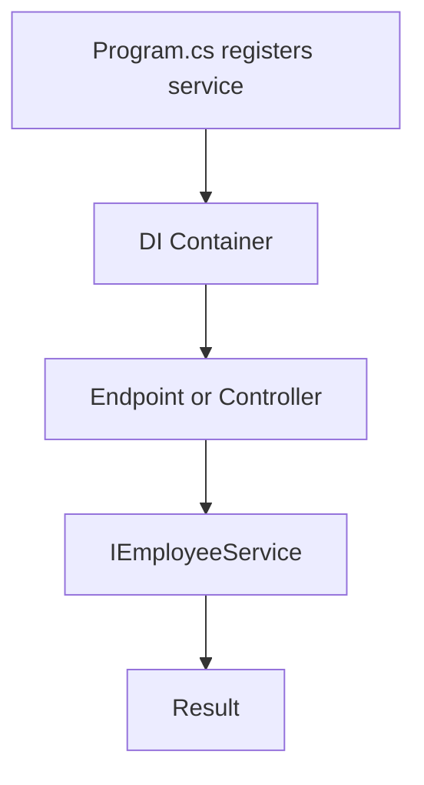

# Lesson 06: Dependency Injection

## Learning Goal
Understand how ASP.NET Core built-in dependency injection helps keep code clean, testable, and loosely coupled.

বাংলা সারাংশ: এই অংশে আপনি পাঠের মূল লক্ষ্য বুঝবেন।

## Beginner-friendly Explanation
Dependency Injection means a class receives the objects it needs instead of creating them manually. ASP.NET Core has a built-in service container where you register services and inject them into controllers or other services.

বাংলা সারাংশ: ধারণাটি সহজভাবে বুঝে নিন, তারপর ছোট উদাহরণ দিয়ে অনুশীলন করুন।

## Real-world Example
`EmployeesController` should not create `EmployeeService` with `new`. Instead, register `IEmployeeService` and receive it through the constructor.

বাংলা সারাংশ: বাস্তব প্রজেক্টে এই ধারণাটি কীভাবে কাজ করে তা লক্ষ্য করুন।

## ASP.NET Core Web API .NET 10 Code Example
```csharp
public interface IEmployeeService
{
    IReadOnlyList<string> GetEmployeeNames();
}

public sealed class EmployeeService : IEmployeeService
{
    public IReadOnlyList<string> GetEmployeeNames() => ["Rahim", "Nusrat", "Karim"];
}

var builder = WebApplication.CreateBuilder(args);
builder.Services.AddScoped<IEmployeeService, EmployeeService>();

var app = builder.Build();

app.MapGet("/api/employees/names", (IEmployeeService service) =>
{
    return Results.Ok(service.GetEmployeeNames());
});

app.Run();
```

বাংলা সারাংশ: কোডটি .NET 10 স্টাইলে লেখা এবং শেখার জন্য সহজ করে দেখানো হয়েছে।

## Mermaid Diagram


## Common Mistakes
- Creating services manually with `new` everywhere.
- Registering a database context as singleton.
- Injecting too many services into one controller.

বাংলা সারাংশ: এই ভুলগুলো এড়িয়ে চললে আপনার API আরও পরিষ্কার হবে।

## Best Practices
- Use interfaces for business services when useful.
- Use `AddScoped` for request-based services.
- Keep dependencies small and focused.

বাংলা সারাংশ: ভাল অভ্যাস মেনে চললে code পড়া, test করা এবং maintain করা সহজ হয়।

## Practice Task
Create an `IDepartmentService` interface and register it with `AddScoped`.

বাংলা সারাংশ: নিজে ছোট একটি উদাহরণ তৈরি করলে ধারণাটি ভালভাবে মনে থাকবে।
