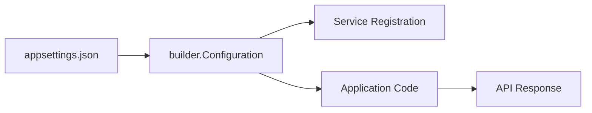

# Lesson 07: appsettings.json

## Learning Goal
Learn how ASP.NET Core stores configuration values such as connection strings, logging levels, and JWT settings.

বাংলা সারাংশ: এই অংশে আপনি পাঠের মূল লক্ষ্য বুঝবেন।

## Beginner-friendly Explanation
`appsettings.json` stores application configuration outside the main code. ASP.NET Core can read these values through `builder.Configuration`. Different environments can use different settings files.

বাংলা সারাংশ: ধারণাটি সহজভাবে বুঝে নিন, তারপর ছোট উদাহরণ দিয়ে অনুশীলন করুন।

## Real-world Example
An Employee API can store the SQL Server connection string and JWT issuer in configuration instead of hardcoding them inside controllers.

বাংলা সারাংশ: বাস্তব প্রজেক্টে এই ধারণাটি কীভাবে কাজ করে তা লক্ষ্য করুন।

## ASP.NET Core Web API .NET 10 Code Example
```csharp
// appsettings.json
{
  "ConnectionStrings": {
    "DefaultConnection": "Server=localhost;Database=EmployeeDb;Trusted_Connection=True;TrustServerCertificate=True"
  },
  "Jwt": {
    "Issuer": "EmployeeApi",
    "Audience": "EmployeeClient"
  }
}

// Program.cs
var builder = WebApplication.CreateBuilder(args);

var connectionString = builder.Configuration.GetConnectionString("DefaultConnection");
var jwtIssuer = builder.Configuration["Jwt:Issuer"];

builder.Services.AddOpenApi();

var app = builder.Build();

app.MapGet("/api/config-check", () => new
{
    HasConnectionString = !string.IsNullOrWhiteSpace(connectionString),
    JwtIssuer = jwtIssuer
});

app.Run();
```

বাংলা সারাংশ: কোডটি .NET 10 স্টাইলে লেখা এবং শেখার জন্য সহজ করে দেখানো হয়েছে।

## Mermaid Diagram


## Common Mistakes
- Storing real production secrets in source control.
- Hardcoding connection strings in controllers.
- Forgetting environment-specific settings.

বাংলা সারাংশ: এই ভুলগুলো এড়িয়ে চললে আপনার API আরও পরিষ্কার হবে।

## Best Practices
- Keep configuration outside business logic.
- Use environment variables or secret storage for sensitive values.
- Group related settings under clear sections.

বাংলা সারাংশ: ভাল অভ্যাস মেনে চললে code পড়া, test করা এবং maintain করা সহজ হয়।

## Practice Task
Add a sample `EmailSettings` section and show how to read `EmailSettings:Sender`.

বাংলা সারাংশ: নিজে ছোট একটি উদাহরণ তৈরি করলে ধারণাটি ভালভাবে মনে থাকবে।
