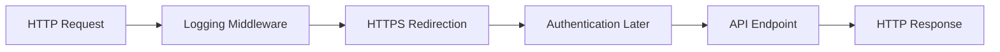

# Lesson 08: Middleware

## Learning Goal
Understand the ASP.NET Core request pipeline and how middleware processes HTTP requests and responses.

বাংলা সারাংশ: এই অংশে আপনি পাঠের মূল লক্ষ্য বুঝবেন।

## Beginner-friendly Explanation
Middleware is a component in the request pipeline. Each middleware can run code before and after the next component. Middleware is used for logging, HTTPS redirection, authentication, authorization, exception handling, and routing.

বাংলা সারাংশ: ধারণাটি সহজভাবে বুঝে নিন, তারপর ছোট উদাহরণ দিয়ে অনুশীলন করুন।

## Real-world Example
When a request comes to an Employee API, exception middleware can handle errors, authentication middleware can check JWT tokens, and endpoint middleware can run the matched API endpoint.

বাংলা সারাংশ: বাস্তব প্রজেক্টে এই ধারণাটি কীভাবে কাজ করে তা লক্ষ্য করুন।

## ASP.NET Core Web API .NET 10 Code Example
```csharp
var builder = WebApplication.CreateBuilder(args);
var app = builder.Build();

app.Use(async (context, next) =>
{
    Console.WriteLine($"Request started: {context.Request.Method} {context.Request.Path}");
    await next();
    Console.WriteLine($"Response status: {context.Response.StatusCode}");
});

app.UseHttpsRedirection();

app.MapGet("/api/pipeline", () => new
{
    Message = "Request passed through middleware",
    Framework = ".NET 10"
});

app.Run();
```

বাংলা সারাংশ: কোডটি .NET 10 স্টাইলে লেখা এবং শেখার জন্য সহজ করে দেখানো হয়েছে।

## Mermaid Diagram


## Common Mistakes
- Putting middleware in the wrong order.
- Forgetting to call `await next()` in custom middleware.
- Doing heavy business logic in middleware.

বাংলা সারাংশ: এই ভুলগুলো এড়িয়ে চললে আপনার API আরও পরিষ্কার হবে।

## Best Practices
- Keep middleware focused on cross-cutting concerns.
- Place exception handling early in the pipeline.
- Use built-in middleware where possible.

বাংলা সারাংশ: ভাল অভ্যাস মেনে চললে code পড়া, test করা এবং maintain করা সহজ হয়।

## Practice Task
Write a custom middleware example that logs request path and response status code.

বাংলা সারাংশ: নিজে ছোট একটি উদাহরণ তৈরি করলে ধারণাটি ভালভাবে মনে থাকবে।
