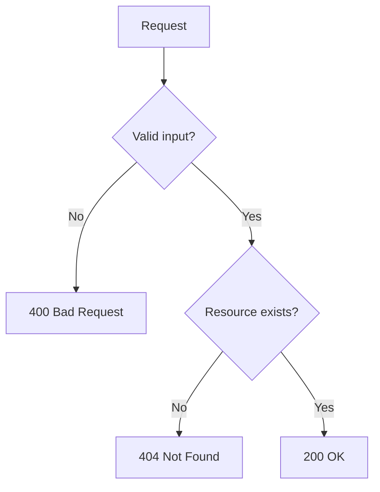

# Lesson 09: Error Handling

## Learning Goal
Learn how to return clear, consistent, and safe error responses from Web API endpoints.

বাংলা সারাংশ: এই অংশে আপনি পাঠের মূল লক্ষ্য বুঝবেন।

## Beginner-friendly Explanation
Error handling means converting invalid input, missing data, and unexpected exceptions into meaningful HTTP responses. Good APIs do not expose sensitive technical details to clients.

বাংলা সারাংশ: ধারণাটি সহজভাবে বুঝে নিন, তারপর ছোট উদাহরণ দিয়ে অনুশীলন করুন।

## Real-world Example
If an employee with ID 50 does not exist, the API should return `404 Not Found`. If the request body is invalid, it should return `400 Bad Request`.

বাংলা সারাংশ: বাস্তব প্রজেক্টে এই ধারণাটি কীভাবে কাজ করে তা লক্ষ্য করুন।

## ASP.NET Core Web API .NET 10 Code Example
```csharp
var builder = WebApplication.CreateBuilder(args);
var app = builder.Build();

app.MapGet("/api/employees/{id:int}", (int id) =>
{
    if (id <= 0)
    {
        return Results.BadRequest(new { Error = "Employee id must be greater than zero." });
    }

    if (id != 1)
    {
        return Results.NotFound(new { Error = "Employee was not found." });
    }

    return Results.Ok(new { Id = 1, Name = "Rahim" });
});

app.Run();
```

বাংলা সারাংশ: কোডটি .NET 10 স্টাইলে লেখা এবং শেখার জন্য সহজ করে দেখানো হয়েছে।

## Mermaid Diagram


## Common Mistakes
- Returning `200 OK` with an error message.
- Showing stack traces to API clients.
- Using different error response shapes everywhere.

বাংলা সারাংশ: এই ভুলগুলো এড়িয়ে চললে আপনার API আরও পরিষ্কার হবে।

## Best Practices
- Use correct HTTP status codes.
- Return simple and consistent error messages.
- Log technical details on the server, not in public responses.

বাংলা সারাংশ: ভাল অভ্যাস মেনে চললে code পড়া, test করা এবং maintain করা সহজ হয়।

## Practice Task
Create error responses for invalid department id and missing department record.

বাংলা সারাংশ: নিজে ছোট একটি উদাহরণ তৈরি করলে ধারণাটি ভালভাবে মনে থাকবে।
