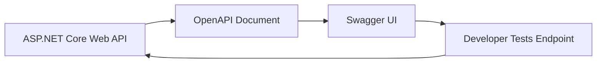

# Lesson 10: Swagger and OpenAPI

## Learning Goal
Understand how Swagger/OpenAPI documents Web API endpoints and helps developers test APIs during development.

বাংলা সারাংশ: এই অংশে আপনি পাঠের মূল লক্ষ্য বুঝবেন।

## Beginner-friendly Explanation
OpenAPI is a standard format for describing APIs. Swagger UI reads the OpenAPI document and shows a browser-based page where developers can inspect endpoints, request bodies, responses, and status codes.

বাংলা সারাংশ: ধারণাটি সহজভাবে বুঝে নিন, তারপর ছোট উদাহরণ দিয়ে অনুশীলন করুন।

## Real-world Example
A frontend developer can open Swagger UI to see how to call `POST /api/employees`, what JSON body is required, and what response to expect.

বাংলা সারাংশ: বাস্তব প্রজেক্টে এই ধারণাটি কীভাবে কাজ করে তা লক্ষ্য করুন।

## ASP.NET Core Web API .NET 10 Code Example
```csharp
var builder = WebApplication.CreateBuilder(args);

builder.Services.AddControllers();
builder.Services.AddOpenApi();

var app = builder.Build();

if (app.Environment.IsDevelopment())
{
    app.MapOpenApi();
}

app.MapGet("/api/employees", () => new[]
{
    new { Id = 1, Name = "Rahim", Department = "HR" },
    new { Id = 2, Name = "Nusrat", Department = "IT" }
});

app.Run();
```

বাংলা সারাংশ: কোডটি .NET 10 স্টাইলে লেখা এবং শেখার জন্য সহজ করে দেখানো হয়েছে।

## Mermaid Diagram


## Common Mistakes
- Thinking Swagger is only for backend developers.
- Leaving unclear endpoint names and DTOs.
- Exposing development documentation publicly without thinking about security.

বাংলা সারাংশ: এই ভুলগুলো এড়িয়ে চললে আপনার API আরও পরিষ্কার হবে।

## Best Practices
- Use clear DTO names so Swagger is readable.
- Document expected status codes.
- Enable public API documentation only according to project security needs.

বাংলা সারাংশ: ভাল অভ্যাস মেনে চললে code পড়া, test করা এবং maintain করা সহজ হয়।

## Practice Task
Write two endpoints and describe how they would appear in Swagger UI.

বাংলা সারাংশ: নিজে ছোট একটি উদাহরণ তৈরি করলে ধারণাটি ভালভাবে মনে থাকবে।
