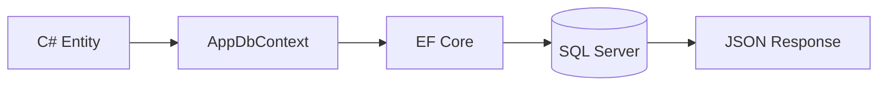

# Lesson 01: Entity Framework Core

## Learning Goal
Learn how EF Core maps C# classes to database tables and lets a Web API query and save data.

বাংলা সারাংশ: এই পাঠটি সহজভাবে ধারণা, ব্যবহার, ভুল এবং বাস্তব অনুশীলন বুঝতে সাহায্য করবে।

## Beginner-friendly Explanation
Entity Framework Core is an Object Relational Mapper. It helps you work with database records using C# classes instead of writing SQL for every operation. In clean architecture thinking, EF Core usually belongs in the Infrastructure layer, while controllers and services depend on abstractions.

বাংলা সারাংশ: এই পাঠটি সহজভাবে ধারণা, ব্যবহার, ভুল এবং বাস্তব অনুশীলন বুঝতে সাহায্য করবে।

## Real-world Example
In an Employee Management API, `Employee` is a C# entity and EF Core can save it into an `Employees` SQL Server table.

বাংলা সারাংশ: এই পাঠটি সহজভাবে ধারণা, ব্যবহার, ভুল এবং বাস্তব অনুশীলন বুঝতে সাহায্য করবে।

## .NET 10 ASP.NET Core Web API Code Example
```csharp
using Microsoft.EntityFrameworkCore;

public sealed class Employee
{
    public int Id { get; set; }
    public string Name { get; set; } = string.Empty;
    public string Department { get; set; } = string.Empty;
}

public sealed class AppDbContext : DbContext
{
    public AppDbContext(DbContextOptions<AppDbContext> options) : base(options) { }
    public DbSet<Employee> Employees => Set<Employee>();
}

var builder = WebApplication.CreateBuilder(args);
builder.Services.AddDbContext<AppDbContext>(options =>
    options.UseSqlServer(builder.Configuration.GetConnectionString("DefaultConnection")));

var app = builder.Build();
app.MapGet("/api/employees", async (AppDbContext db) =>
    await db.Employees.AsNoTracking().ToListAsync());
app.Run();
```

বাংলা সারাংশ: এই পাঠটি সহজভাবে ধারণা, ব্যবহার, ভুল এবং বাস্তব অনুশীলন বুঝতে সাহায্য করবে।

## Mermaid Diagram


## Common Mistakes
- Putting EF Core queries directly in many controllers.
- Loading too much data without projection or pagination.
- Forgetting `AsNoTracking()` for read-only queries.

বাংলা সারাংশ: এই পাঠটি সহজভাবে ধারণা, ব্যবহার, ভুল এবং বাস্তব অনুশীলন বুঝতে সাহায্য করবে।

## Best Practices
- Keep EF Core data access in Infrastructure or repository classes for larger apps.
- Use async methods such as `ToListAsync()` and `FirstOrDefaultAsync()`.
- Use DTO projection for list endpoints.

বাংলা সারাংশ: এই পাঠটি সহজভাবে ধারণা, ব্যবহার, ভুল এবং বাস্তব অনুশীলন বুঝতে সাহায্য করবে।

## Practice Task
Create a `Department` entity and add `DbSet<Department>` to `AppDbContext`.

বাংলা সারাংশ: এই পাঠটি সহজভাবে ধারণা, ব্যবহার, ভুল এবং বাস্তব অনুশীলন বুঝতে সাহায্য করবে।
