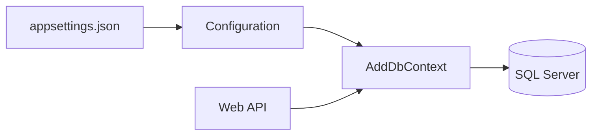

# Lesson 02: SQL Server Connection

## Learning Goal
Learn how a .NET 10 Web API reads a SQL Server connection string and registers EF Core with SQL Server.

বাংলা সারাংশ: এই পাঠটি সহজভাবে ধারণা, ব্যবহার, ভুল এবং বাস্তব অনুশীলন বুঝতে সাহায্য করবে।

## Beginner-friendly Explanation
A connection string tells the API where the database is, which database to use, and how to authenticate. The API should read this value from configuration, not hardcode it inside controllers.

বাংলা সারাংশ: এই পাঠটি সহজভাবে ধারণা, ব্যবহার, ভুল এবং বাস্তব অনুশীলন বুঝতে সাহায্য করবে।

## Real-world Example
Development can use a local SQL Server database named `EmployeeDb`, while production can use a different secure connection from environment variables.

বাংলা সারাংশ: এই পাঠটি সহজভাবে ধারণা, ব্যবহার, ভুল এবং বাস্তব অনুশীলন বুঝতে সাহায্য করবে।

## .NET 10 ASP.NET Core Web API Code Example
```csharp
// appsettings.json
{
  "ConnectionStrings": {
    "DefaultConnection": "Server=localhost;Database=EmployeeDb;Trusted_Connection=True;TrustServerCertificate=True"
  }
}

// Program.cs
var builder = WebApplication.CreateBuilder(args);
var connectionString = builder.Configuration.GetConnectionString("DefaultConnection");

builder.Services.AddDbContext<AppDbContext>(options =>
    options.UseSqlServer(connectionString));

var app = builder.Build();
app.MapGet("/api/database/status", () => Results.Ok(new
{
    Provider = "SQL Server",
    ConnectedByConfiguration = !string.IsNullOrWhiteSpace(connectionString)
}));
app.Run();
```

বাংলা সারাংশ: এই পাঠটি সহজভাবে ধারণা, ব্যবহার, ভুল এবং বাস্তব অনুশীলন বুঝতে সাহায্য করবে।

## Mermaid Diagram


## Common Mistakes
- Committing production passwords in `appsettings.json`.
- Hardcoding connection strings in service classes.
- Using the same database for development and production.

বাংলা সারাংশ: এই পাঠটি সহজভাবে ধারণা, ব্যবহার, ভুল এবং বাস্তব অনুশীলন বুঝতে সাহায্য করবে।

## Best Practices
- Use configuration and environment variables for connection strings.
- Keep secrets out of Git.
- Use separate databases for development, testing, and production.

বাংলা সারাংশ: এই পাঠটি সহজভাবে ধারণা, ব্যবহার, ভুল এবং বাস্তব অনুশীলন বুঝতে সাহায্য করবে।

## Practice Task
Write a sample `DefaultConnection` string for a local `CompanyDb` database.

বাংলা সারাংশ: এই পাঠটি সহজভাবে ধারণা, ব্যবহার, ভুল এবং বাস্তব অনুশীলন বুঝতে সাহায্য করবে।
