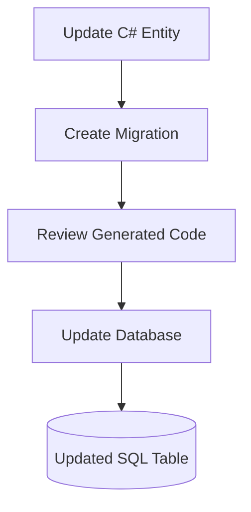

# Lesson 03: Code First Migration

## Learning Goal
Understand how EF Core migrations create and update database schema from C# entity classes.

বাংলা সারাংশ: এই পাঠটি সহজভাবে ধারণা, ব্যবহার, ভুল এবং বাস্তব অনুশীলন বুঝতে সাহায্য করবে।

## Beginner-friendly Explanation
Code First means you design C# entity classes first, then EF Core creates migration files that describe database schema changes. Migrations make database changes trackable and repeatable.

বাংলা সারাংশ: এই পাঠটি সহজভাবে ধারণা, ব্যবহার, ভুল এবং বাস্তব অনুশীলন বুঝতে সাহায্য করবে।

## Real-world Example
If you add `Email` to the `Employee` entity, EF Core can generate a migration that adds an `Email` column to the `Employees` table.

বাংলা সারাংশ: এই পাঠটি সহজভাবে ধারণা, ব্যবহার, ভুল এবং বাস্তব অনুশীলন বুঝতে সাহায্য করবে।

## .NET 10 ASP.NET Core Web API Code Example
```csharp
public sealed class Employee
{
    public int Id { get; set; }
    public string Name { get; set; } = string.Empty;
    public string Email { get; set; } = string.Empty;
}

// Common EF Core commands:
// dotnet ef migrations add AddEmployeeEmail
// dotnet ef database update

var builder = WebApplication.CreateBuilder(args);
builder.Services.AddDbContext<AppDbContext>(options =>
    options.UseSqlServer(builder.Configuration.GetConnectionString("DefaultConnection")));
```

বাংলা সারাংশ: এই পাঠটি সহজভাবে ধারণা, ব্যবহার, ভুল এবং বাস্তব অনুশীলন বুঝতে সাহায্য করবে।

## Mermaid Diagram


## Common Mistakes
- Running migrations without reviewing generated changes.
- Editing production database manually while also using migrations.
- Deleting migration files after they are applied by a team.

বাংলা সারাংশ: এই পাঠটি সহজভাবে ধারণা, ব্যবহার, ভুল এবং বাস্তব অনুশীলন বুঝতে সাহায্য করবে।

## Best Practices
- Review migration files before applying them.
- Keep migrations in source control.
- Use clear migration names such as `AddEmployeeEmail`.

বাংলা সারাংশ: এই পাঠটি সহজভাবে ধারণা, ব্যবহার, ভুল এবং বাস্তব অনুশীলন বুঝতে সাহায্য করবে।

## Practice Task
Add a `PhoneNumber` property to an `Employee` entity and write the migration command name you would use.

বাংলা সারাংশ: এই পাঠটি সহজভাবে ধারণা, ব্যবহার, ভুল এবং বাস্তব অনুশীলন বুঝতে সাহায্য করবে।
