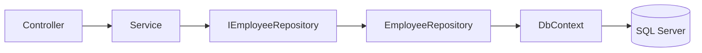

# Lesson 04: Repository Pattern

## Learning Goal
Learn how repositories hide data access details behind clear interfaces.

বাংলা সারাংশ: এই পাঠটি সহজভাবে ধারণা, ব্যবহার, ভুল এবং বাস্তব অনুশীলন বুঝতে সাহায্য করবে।

## Beginner-friendly Explanation
The Repository Pattern creates a data access boundary. Services ask repositories for data, and repositories decide how to query the database. This keeps business logic away from EF Core query details.

বাংলা সারাংশ: এই পাঠটি সহজভাবে ধারণা, ব্যবহার, ভুল এবং বাস্তব অনুশীলন বুঝতে সাহায্য করবে।

## Real-world Example
`EmployeeService` can call `IEmployeeRepository.GetByIdAsync(id)` without knowing whether data comes from EF Core, cache, or another service.

বাংলা সারাংশ: এই পাঠটি সহজভাবে ধারণা, ব্যবহার, ভুল এবং বাস্তব অনুশীলন বুঝতে সাহায্য করবে।

## .NET 10 ASP.NET Core Web API Code Example
```csharp
public interface IEmployeeRepository
{
    Task<Employee?> GetByIdAsync(int id, CancellationToken cancellationToken);
    Task AddAsync(Employee employee, CancellationToken cancellationToken);
}

public sealed class EmployeeRepository : IEmployeeRepository
{
    private readonly AppDbContext db;
    public EmployeeRepository(AppDbContext db) => this.db = db;

    public Task<Employee?> GetByIdAsync(int id, CancellationToken cancellationToken)
    {
        return db.Employees.FirstOrDefaultAsync(x => x.Id == id, cancellationToken);
    }

    public async Task AddAsync(Employee employee, CancellationToken cancellationToken)
    {
        db.Employees.Add(employee);
        await db.SaveChangesAsync(cancellationToken);
    }
}

builder.Services.AddScoped<IEmployeeRepository, EmployeeRepository>();
```

বাংলা সারাংশ: এই পাঠটি সহজভাবে ধারণা, ব্যবহার, ভুল এবং বাস্তব অনুশীলন বুঝতে সাহায্য করবে।

## Mermaid Diagram


## Common Mistakes
- Creating generic repositories that add no value.
- Putting business rules inside repositories.
- Returning `IQueryable` everywhere and leaking database details.

বাংলা সারাংশ: এই পাঠটি সহজভাবে ধারণা, ব্যবহার, ভুল এবং বাস্তব অনুশীলন বুঝতে সাহায্য করবে।

## Best Practices
- Use repositories when they simplify data access boundaries.
- Keep business decisions in services/application layer.
- Return domain entities or DTO projections intentionally.

বাংলা সারাংশ: এই পাঠটি সহজভাবে ধারণা, ব্যবহার, ভুল এবং বাস্তব অনুশীলন বুঝতে সাহায্য করবে।

## Practice Task
Create an `IDepartmentRepository` interface with `GetAllAsync` and `GetByIdAsync` methods.

বাংলা সারাংশ: এই পাঠটি সহজভাবে ধারণা, ব্যবহার, ভুল এবং বাস্তব অনুশীলন বুঝতে সাহায্য করবে।
