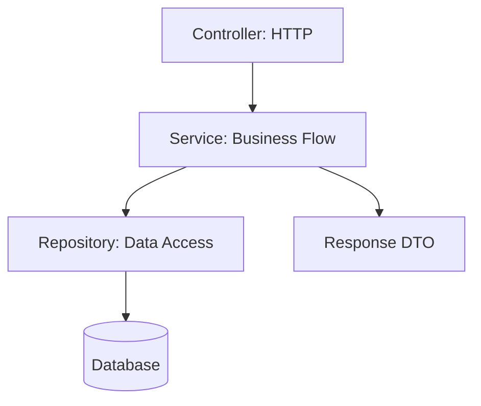

# Lesson 05: Service Layer

## Learning Goal
Learn how a service layer keeps business logic out of controllers.

বাংলা সারাংশ: এই পাঠটি সহজভাবে ধারণা, ব্যবহার, ভুল এবং বাস্তব অনুশীলন বুঝতে সাহায্য করবে।

## Beginner-friendly Explanation
The service layer contains application workflow and business rules. Controllers should handle HTTP concerns, then call services. In clean architecture thinking, this belongs in the Application layer.

বাংলা সারাংশ: এই পাঠটি সহজভাবে ধারণা, ব্যবহার, ভুল এবং বাস্তব অনুশীলন বুঝতে সাহায্য করবে।

## Real-world Example
When creating an employee, the service can check whether the department exists, apply business rules, call a repository, and return a response DTO.

বাংলা সারাংশ: এই পাঠটি সহজভাবে ধারণা, ব্যবহার, ভুল এবং বাস্তব অনুশীলন বুঝতে সাহায্য করবে।

## .NET 10 ASP.NET Core Web API Code Example
```csharp
public interface IEmployeeService
{
    Task<EmployeeResponse> CreateAsync(CreateEmployeeRequest request, CancellationToken cancellationToken);
}

public sealed class EmployeeService : IEmployeeService
{
    private readonly IEmployeeRepository employees;
    public EmployeeService(IEmployeeRepository employees) => this.employees = employees;

    public async Task<EmployeeResponse> CreateAsync(CreateEmployeeRequest request, CancellationToken cancellationToken)
    {
        var employee = new Employee { Name = request.Name, Department = request.Department };
        await employees.AddAsync(employee, cancellationToken);
        return new EmployeeResponse(employee.Id, employee.Name, employee.Department);
    }
}

public sealed record CreateEmployeeRequest(string Name, string Department);
public sealed record EmployeeResponse(int Id, string Name, string Department);
builder.Services.AddScoped<IEmployeeService, EmployeeService>();
```

বাংলা সারাংশ: এই পাঠটি সহজভাবে ধারণা, ব্যবহার, ভুল এবং বাস্তব অনুশীলন বুঝতে সাহায্য করবে।

## Mermaid Diagram


## Common Mistakes
- Putting validation, database access, and business rules directly in controllers.
- Making one huge service class for all modules.
- Returning EF Core entities directly from service methods used by API responses.

বাংলা সারাংশ: এই পাঠটি সহজভাবে ধারণা, ব্যবহার, ভুল এবং বাস্তব অনুশীলন বুঝতে সাহায্য করবে।

## Best Practices
- Keep controllers thin.
- Create focused services per module or use case.
- Return response DTOs or application results from service methods.

বাংলা সারাংশ: এই পাঠটি সহজভাবে ধারণা, ব্যবহার, ভুল এবং বাস্তব অনুশীলন বুঝতে সাহায্য করবে।

## Practice Task
Move a department creation rule into a `DepartmentService` example.

বাংলা সারাংশ: এই পাঠটি সহজভাবে ধারণা, ব্যবহার, ভুল এবং বাস্তব অনুশীলন বুঝতে সাহায্য করবে।
