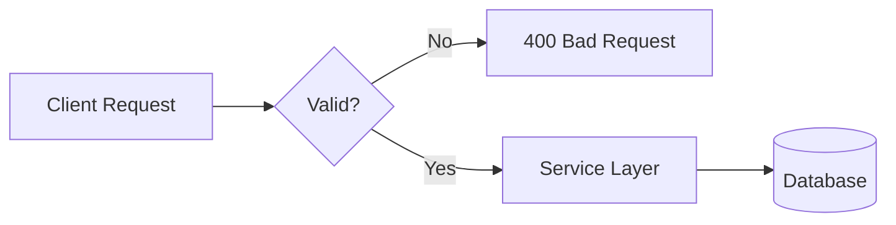

# Lesson 06: Validation

## Learning Goal
Learn how to validate request data before business logic and database operations run.

বাংলা সারাংশ: এই পাঠটি সহজভাবে ধারণা, ব্যবহার, ভুল এবং বাস্তব অনুশীলন বুঝতে সাহায্য করবে।

## Beginner-friendly Explanation
Validation checks whether client input is acceptable. Basic validation can use data annotations. Larger projects may use FluentValidation. Validation should protect the service layer from bad input.

বাংলা সারাংশ: এই পাঠটি সহজভাবে ধারণা, ব্যবহার, ভুল এবং বাস্তব অনুশীলন বুঝতে সাহায্য করবে।

## Real-world Example
An employee name is required, email must be valid, and department id must be greater than zero.

বাংলা সারাংশ: এই পাঠটি সহজভাবে ধারণা, ব্যবহার, ভুল এবং বাস্তব অনুশীলন বুঝতে সাহায্য করবে।

## .NET 10 ASP.NET Core Web API Code Example
```csharp
using System.ComponentModel.DataAnnotations;

public sealed class CreateEmployeeRequest
{
    [Required]
    [MaxLength(100)]
    public string Name { get; set; } = string.Empty;

    [Required]
    [EmailAddress]
    public string Email { get; set; } = string.Empty;

    [Range(1, int.MaxValue)]
    public int DepartmentId { get; set; }
}

app.MapPost("/api/employees", (CreateEmployeeRequest request) =>
{
    return Results.Created("/api/employees/1", new { Id = 1, request.Name, request.Email, request.DepartmentId });
});
```

বাংলা সারাংশ: এই পাঠটি সহজভাবে ধারণা, ব্যবহার, ভুল এবং বাস্তব অনুশীলন বুঝতে সাহায্য করবে।

## Mermaid Diagram


## Common Mistakes
- Trusting frontend validation only.
- Saving invalid data and trying to fix it later.
- Mixing complex business rules with simple input validation.

বাংলা সারাংশ: এই পাঠটি সহজভাবে ধারণা, ব্যবহার, ভুল এবং বাস্তব অনুশীলন বুঝতে সাহায্য করবে।

## Best Practices
- Validate required fields and length limits at the API boundary.
- Keep business validation in the service/application layer.
- Return clear validation messages.

বাংলা সারাংশ: এই পাঠটি সহজভাবে ধারণা, ব্যবহার, ভুল এবং বাস্তব অনুশীলন বুঝতে সাহায্য করবে।

## Practice Task
Create validation rules for `CreateDepartmentRequest` with `Name` required and max length 80.

বাংলা সারাংশ: এই পাঠটি সহজভাবে ধারণা, ব্যবহার, ভুল এবং বাস্তব অনুশীলন বুঝতে সাহায্য করবে।
