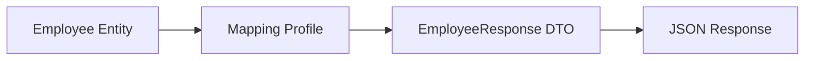

# Lesson 07: AutoMapper

## Learning Goal
Understand how AutoMapper reduces repetitive mapping between entities and DTOs.

বাংলা সারাংশ: এই পাঠটি সহজভাবে ধারণা, ব্যবহার, ভুল এবং বাস্তব অনুশীলন বুঝতে সাহায্য করবে।

## Beginner-friendly Explanation
AutoMapper copies values from one object type to another based on configuration. It is useful when mapping entities to response DTOs or request DTOs to entities. Use it carefully so mappings stay understandable.

বাংলা সারাংশ: এই পাঠটি সহজভাবে ধারণা, ব্যবহার, ভুল এবং বাস্তব অনুশীলন বুঝতে সাহায্য করবে।

## Real-world Example
Map `Employee` entity to `EmployeeResponse` DTO without manually assigning every matching property.

বাংলা সারাংশ: এই পাঠটি সহজভাবে ধারণা, ব্যবহার, ভুল এবং বাস্তব অনুশীলন বুঝতে সাহায্য করবে।

## .NET 10 ASP.NET Core Web API Code Example
```csharp
using AutoMapper;

public sealed class Employee
{
    public int Id { get; set; }
    public string Name { get; set; } = string.Empty;
    public string Department { get; set; } = string.Empty;
}

public sealed record EmployeeResponse(int Id, string Name, string Department);

public sealed class EmployeeMappingProfile : Profile
{
    public EmployeeMappingProfile()
    {
        CreateMap<Employee, EmployeeResponse>();
    }
}

builder.Services.AddAutoMapper(typeof(EmployeeMappingProfile));

app.MapGet("/api/employees/{id:int}", (int id, IMapper mapper) =>
{
    var employee = new Employee { Id = id, Name = "Rahim", Department = "HR" };
    return Results.Ok(mapper.Map<EmployeeResponse>(employee));
});
```

বাংলা সারাংশ: এই পাঠটি সহজভাবে ধারণা, ব্যবহার, ভুল এবং বাস্তব অনুশীলন বুঝতে সাহায্য করবে।

## Mermaid Diagram


## Common Mistakes
- Using AutoMapper to hide complex business logic.
- Not testing custom mappings.
- Mapping sensitive fields accidentally.

বাংলা সারাংশ: এই পাঠটি সহজভাবে ধারণা, ব্যবহার, ভুল এবং বাস্তব অনুশীলন বুঝতে সাহায্য করবে।

## Best Practices
- Use explicit profiles.
- Keep complex transformations readable.
- Review response DTOs to avoid leaking internal data.

বাংলা সারাংশ: এই পাঠটি সহজভাবে ধারণা, ব্যবহার, ভুল এবং বাস্তব অনুশীলন বুঝতে সাহায্য করবে।

## Practice Task
Create a mapping profile for `Department` to `DepartmentResponse`.

বাংলা সারাংশ: এই পাঠটি সহজভাবে ধারণা, ব্যবহার, ভুল এবং বাস্তব অনুশীলন বুঝতে সাহায্য করবে।
