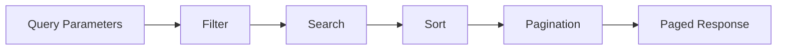

# Lesson 08: Pagination, Filtering, Searching, and Sorting

## Learning Goal
Learn how to design list endpoints that are fast, useful, and scalable.

বাংলা সারাংশ: এই পাঠটি সহজভাবে ধারণা, ব্যবহার, ভুল এবং বাস্তব অনুশীলন বুঝতে সাহায্য করবে।

## Beginner-friendly Explanation
Large APIs should not return every row at once. Pagination limits result size. Filtering narrows results by fields. Searching matches text. Sorting orders results. These features make list endpoints practical.

বাংলা সারাংশ: এই পাঠটি সহজভাবে ধারণা, ব্যবহার, ভুল এবং বাস্তব অনুশীলন বুঝতে সাহায্য করবে।

## Real-world Example
`GET /api/employees?page=1&pageSize=20&department=IT&search=rahim&sort=name` returns a manageable, useful employee list.

বাংলা সারাংশ: এই পাঠটি সহজভাবে ধারণা, ব্যবহার, ভুল এবং বাস্তব অনুশীলন বুঝতে সাহায্য করবে।

## .NET 10 ASP.NET Core Web API Code Example
```csharp
public sealed record EmployeeQuery(int Page = 1, int PageSize = 20, string? Department = null, string? Search = null, string Sort = "name");

app.MapGet("/api/employees", async ([AsParameters] EmployeeQuery query, AppDbContext db) =>
{
    var employees = db.Employees.AsNoTracking();

    if (!string.IsNullOrWhiteSpace(query.Department))
        employees = employees.Where(x => x.Department == query.Department);

    if (!string.IsNullOrWhiteSpace(query.Search))
        employees = employees.Where(x => x.Name.Contains(query.Search));

    employees = query.Sort.ToLowerInvariant() == "department"
        ? employees.OrderBy(x => x.Department)
        : employees.OrderBy(x => x.Name);

    var data = await employees.Skip((query.Page - 1) * query.PageSize).Take(query.PageSize).Select(x => new { x.Id, x.Name, x.Department }).ToListAsync();
    return Results.Ok(data);
});
```

বাংলা সারাংশ: এই পাঠটি সহজভাবে ধারণা, ব্যবহার, ভুল এবং বাস্তব অনুশীলন বুঝতে সাহায্য করবে।

## Mermaid Diagram


## Common Mistakes
- Returning all records from list endpoints.
- Allowing unlimited `pageSize`.
- Sorting by unsafe or unknown column names.

বাংলা সারাংশ: এই পাঠটি সহজভাবে ধারণা, ব্যবহার, ভুল এবং বাস্তব অনুশীলন বুঝতে সাহায্য করবে।

## Best Practices
- Set default and maximum page size.
- Use projection with `Select` for list responses.
- Whitelist allowed sort fields.

বাংলা সারাংশ: এই পাঠটি সহজভাবে ধারণা, ব্যবহার, ভুল এবং বাস্তব অনুশীলন বুঝতে সাহায্য করবে।

## Practice Task
Design query parameters for a `GET /api/departments` list endpoint.

বাংলা সারাংশ: এই পাঠটি সহজভাবে ধারণা, ব্যবহার, ভুল এবং বাস্তব অনুশীলন বুঝতে সাহায্য করবে।
