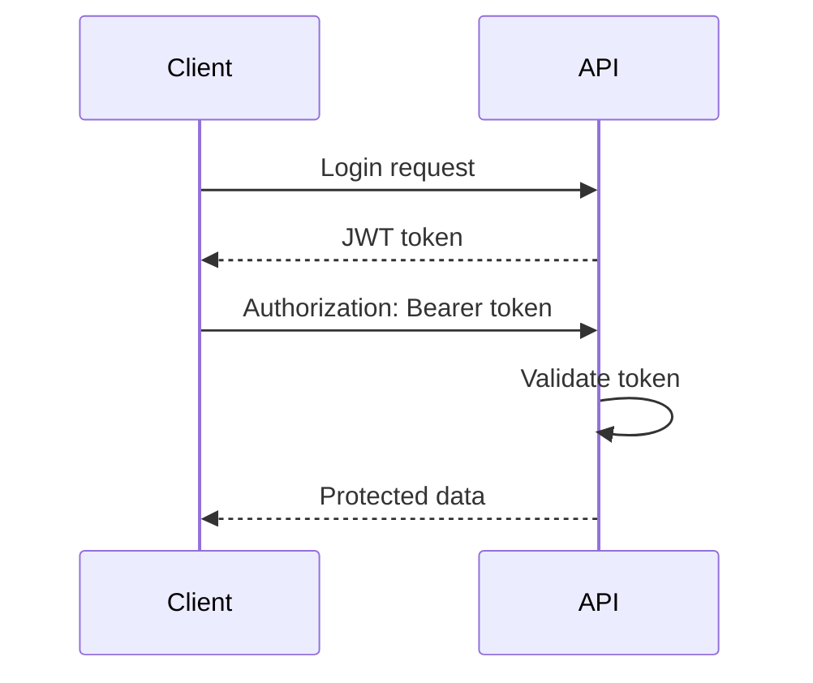

# Lesson 09: JWT Authentication

## Learning Goal
Learn how JWT authentication proves who is calling your Web API.

বাংলা সারাংশ: এই পাঠটি সহজভাবে ধারণা, ব্যবহার, ভুল এবং বাস্তব অনুশীলন বুঝতে সাহায্য করবে।

## Beginner-friendly Explanation
JWT means JSON Web Token. After login, the API issues a signed token. The client sends it in the `Authorization: Bearer token` header. The API validates the token and reads claims such as user id and role.

বাংলা সারাংশ: এই পাঠটি সহজভাবে ধারণা, ব্যবহার, ভুল এবং বাস্তব অনুশীলন বুঝতে সাহায্য করবে।

## Real-world Example
An HR user logs in, receives a JWT, and uses that token to call protected employee endpoints.

বাংলা সারাংশ: এই পাঠটি সহজভাবে ধারণা, ব্যবহার, ভুল এবং বাস্তব অনুশীলন বুঝতে সাহায্য করবে।

## .NET 10 ASP.NET Core Web API Code Example
```csharp
using Microsoft.AspNetCore.Authentication.JwtBearer;
using Microsoft.IdentityModel.Tokens;
using System.Text;

var builder = WebApplication.CreateBuilder(args);
var jwtKey = builder.Configuration["Jwt:Key"] ?? "development-secret-key-change-this";

builder.Services.AddAuthentication(JwtBearerDefaults.AuthenticationScheme)
    .AddJwtBearer(options =>
    {
        options.TokenValidationParameters = new TokenValidationParameters
        {
            ValidateIssuerSigningKey = true,
            IssuerSigningKey = new SymmetricSecurityKey(Encoding.UTF8.GetBytes(jwtKey)),
            ValidateIssuer = false,
            ValidateAudience = false
        };
    });

builder.Services.AddAuthorization();
var app = builder.Build();
app.UseAuthentication();
app.UseAuthorization();
app.MapGet("/api/profile", () => Results.Ok("Protected profile")).RequireAuthorization();
app.Run();
```

বাংলা সারাংশ: এই পাঠটি সহজভাবে ধারণা, ব্যবহার, ভুল এবং বাস্তব অনুশীলন বুঝতে সাহায্য করবে।

## Mermaid Diagram


## Common Mistakes
- Storing JWT secret in source control.
- Using very long token lifetime without refresh strategy.
- Confusing authentication with authorization.

বাংলা সারাংশ: এই পাঠটি সহজভাবে ধারণা, ব্যবহার, ভুল এবং বাস্তব অনুশীলন বুঝতে সাহায্য করবে।

## Best Practices
- Store JWT secrets securely.
- Use HTTPS.
- Keep tokens short-lived and validate signing keys.

বাংলা সারাংশ: এই পাঠটি সহজভাবে ধারণা, ব্যবহার, ভুল এবং বাস্তব অনুশীলন বুঝতে সাহায্য করবে।

## Practice Task
Write the request header needed to call a protected endpoint with JWT.

বাংলা সারাংশ: এই পাঠটি সহজভাবে ধারণা, ব্যবহার, ভুল এবং বাস্তব অনুশীলন বুঝতে সাহায্য করবে।
