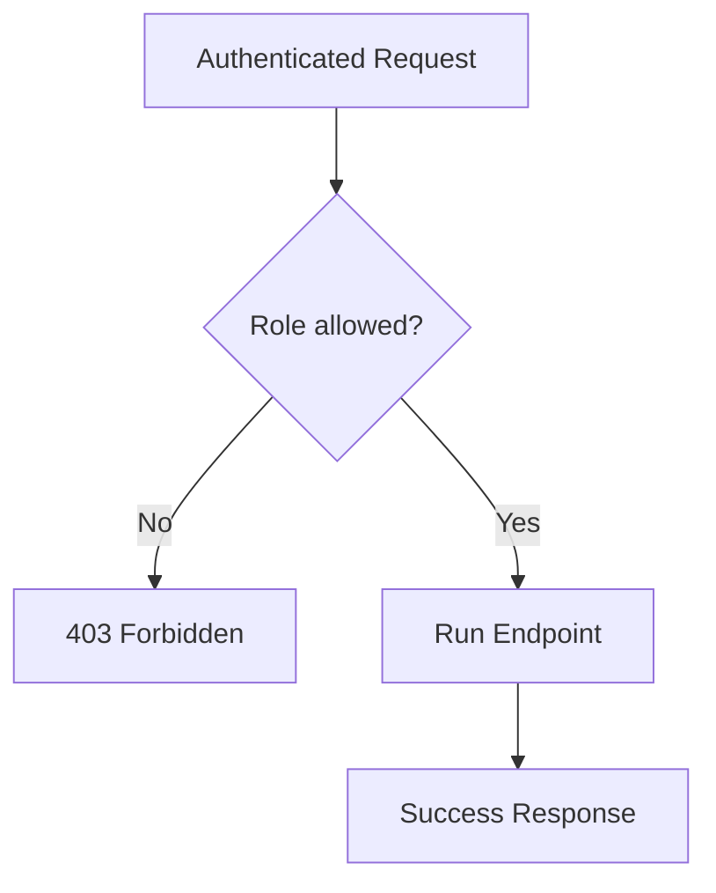

# Lesson 10: Role-based Authorization

## Learning Goal
Learn how roles control what authenticated users are allowed to do.

বাংলা সারাংশ: এই পাঠটি সহজভাবে ধারণা, ব্যবহার, ভুল এবং বাস্তব অনুশীলন বুঝতে সাহায্য করবে।

## Beginner-friendly Explanation
Authentication identifies the user. Authorization decides what the user can access. Role-based authorization checks claims such as `Admin`, `HR`, or `Employee` before allowing an endpoint to run.

বাংলা সারাংশ: এই পাঠটি সহজভাবে ধারণা, ব্যবহার, ভুল এবং বাস্তব অনুশীলন বুঝতে সাহায্য করবে।

## Real-world Example
Only users with the `HR` role can approve leave requests. Employees can view their own profile but cannot approve payroll.

বাংলা সারাংশ: এই পাঠটি সহজভাবে ধারণা, ব্যবহার, ভুল এবং বাস্তব অনুশীলন বুঝতে সাহায্য করবে।

## .NET 10 ASP.NET Core Web API Code Example
```csharp
using Microsoft.AspNetCore.Authorization;
using Microsoft.AspNetCore.Mvc;

[ApiController]
[Route("api/[controller]")]
public sealed class PayrollController : ControllerBase
{
    [HttpPost("run")]
    [Authorize(Roles = "Admin,HR")]
    public IActionResult RunPayroll() => Ok(new { Message = "Payroll run started." });

    [HttpGet("my-payslip")]
    [Authorize(Roles = "Employee,HR,Admin")]
    public IActionResult MyPayslip() => Ok(new { Month = "January", Amount = 50000 });
}

app.MapPost("/api/leaves/{id:int}/approve", (int id) => Results.Ok())
   .RequireAuthorization(policy => policy.RequireRole("HR", "Admin"));
```

বাংলা সারাংশ: এই পাঠটি সহজভাবে ধারণা, ব্যবহার, ভুল এবং বাস্তব অনুশীলন বুঝতে সাহায্য করবে।

## Mermaid Diagram


## Common Mistakes
- Checking roles manually in every method.
- Using roles when a policy would be clearer.
- Giving too many users the Admin role.

বাংলা সারাংশ: এই পাঠটি সহজভাবে ধারণা, ব্যবহার, ভুল এবং বাস্তব অনুশীলন বুঝতে সাহায্য করবে।

## Best Practices
- Use `[Authorize(Roles = "...")]` or policies.
- Apply least privilege.
- Keep role names consistent.

বাংলা সারাংশ: এই পাঠটি সহজভাবে ধারণা, ব্যবহার, ভুল এবং বাস্তব অনুশীলন বুঝতে সাহায্য করবে।

## Practice Task
Create role rules for `Department` create, update, and read endpoints.

বাংলা সারাংশ: এই পাঠটি সহজভাবে ধারণা, ব্যবহার, ভুল এবং বাস্তব অনুশীলন বুঝতে সাহায্য করবে।
