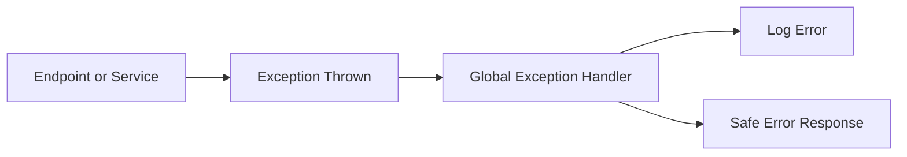

# Lesson 11: Global Exception Handling

## Learning Goal
Learn how to centralize unexpected error handling instead of repeating try/catch in every endpoint.

বাংলা সারাংশ: এই পাঠটি সহজভাবে ধারণা, ব্যবহার, ভুল এবং বাস্তব অনুশীলন বুঝতে সাহায্য করবে।

## Beginner-friendly Explanation
Global exception handling catches unhandled exceptions in one place and converts them into consistent HTTP responses. Controllers and services can stay clean while errors are logged and returned safely.

বাংলা সারাংশ: এই পাঠটি সহজভাবে ধারণা, ব্যবহার, ভুল এবং বাস্তব অনুশীলন বুঝতে সাহায্য করবে।

## Real-world Example
If `EmployeeService` throws an unexpected exception, global handling logs it and returns a safe `500 Internal Server Error` response.

বাংলা সারাংশ: এই পাঠটি সহজভাবে ধারণা, ব্যবহার, ভুল এবং বাস্তব অনুশীলন বুঝতে সাহায্য করবে।

## .NET 10 ASP.NET Core Web API Code Example
```csharp
using Microsoft.AspNetCore.Diagnostics;

public sealed class GlobalExceptionHandler : IExceptionHandler
{
    private readonly ILogger<GlobalExceptionHandler> logger;
    public GlobalExceptionHandler(ILogger<GlobalExceptionHandler> logger) => this.logger = logger;

    public async ValueTask<bool> TryHandleAsync(HttpContext httpContext, Exception exception, CancellationToken cancellationToken)
    {
        logger.LogError(exception, "Unhandled exception occurred.");
        httpContext.Response.StatusCode = StatusCodes.Status500InternalServerError;
        await httpContext.Response.WriteAsJsonAsync(new { Error = "Something went wrong. Please try again later." }, cancellationToken);
        return true;
    }
}

builder.Services.AddExceptionHandler<GlobalExceptionHandler>();
var app = builder.Build();
app.UseExceptionHandler(_ => { });
```

বাংলা সারাংশ: এই পাঠটি সহজভাবে ধারণা, ব্যবহার, ভুল এবং বাস্তব অনুশীলন বুঝতে সাহায্য করবে।

## Mermaid Diagram


## Common Mistakes
- Adding try/catch to every controller action.
- Returning stack traces to clients.
- Not logging exceptions before returning an error.

বাংলা সারাংশ: এই পাঠটি সহজভাবে ধারণা, ব্যবহার, ভুল এবং বাস্তব অনুশীলন বুঝতে সাহায্য করবে।

## Best Practices
- Centralize unhandled exception responses.
- Return safe public messages.
- Log enough detail for developers and operations.

বাংলা সারাংশ: এই পাঠটি সহজভাবে ধারণা, ব্যবহার, ভুল এবং বাস্তব অনুশীলন বুঝতে সাহায্য করবে।

## Practice Task
Design a global response shape with `error`, `traceId`, and `statusCode` fields.

বাংলা সারাংশ: এই পাঠটি সহজভাবে ধারণা, ব্যবহার, ভুল এবং বাস্তব অনুশীলন বুঝতে সাহায্য করবে।
