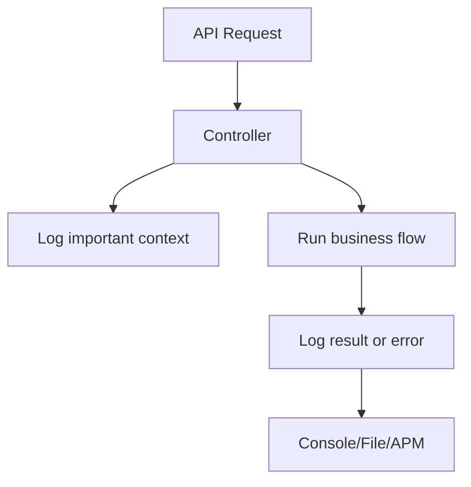

# Lesson 12: Logging

## Learning Goal
Learn how logging helps you understand API behavior, debug problems, and monitor production systems.

বাংলা সারাংশ: এই পাঠটি সহজভাবে ধারণা, ব্যবহার, ভুল এবং বাস্তব অনুশীলন বুঝতে সাহায্য করবে।

## Beginner-friendly Explanation
Logging records important events while the API runs. Good logs include what happened, where it happened, and useful context like employee id or request id. Logging is a cross-cutting concern and should not replace proper error handling.

বাংলা সারাংশ: এই পাঠটি সহজভাবে ধারণা, ব্যবহার, ভুল এবং বাস্তব অনুশীলন বুঝতে সাহায্য করবে।

## Real-world Example
When an employee is created, log the new employee id. When payroll fails, log the exception and payroll run id.

বাংলা সারাংশ: এই পাঠটি সহজভাবে ধারণা, ব্যবহার, ভুল এবং বাস্তব অনুশীলন বুঝতে সাহায্য করবে।

## .NET 10 ASP.NET Core Web API Code Example
```csharp
using Microsoft.AspNetCore.Mvc;

[ApiController]
[Route("api/[controller]")]
public sealed class EmployeesController : ControllerBase
{
    private readonly ILogger<EmployeesController> logger;
    public EmployeesController(ILogger<EmployeesController> logger) => this.logger = logger;

    [HttpPost]
    public IActionResult Create(CreateEmployeeRequest request)
    {
        logger.LogInformation("Creating employee with email {Email}", request.Email);
        var employeeId = 101;
        logger.LogInformation("Employee created with id {EmployeeId}", employeeId);
        return Created($"/api/employees/{employeeId}", new { Id = employeeId, request.Name });
    }
}

public sealed record CreateEmployeeRequest(string Name, string Email);
```

বাংলা সারাংশ: এই পাঠটি সহজভাবে ধারণা, ব্যবহার, ভুল এবং বাস্তব অনুশীলন বুঝতে সাহায্য করবে।

## Mermaid Diagram


## Common Mistakes
- Logging passwords, tokens, or sensitive personal data.
- Using only `Console.WriteLine` in real APIs.
- Logging too much noise and hiding important events.

বাংলা সারাংশ: এই পাঠটি সহজভাবে ধারণা, ব্যবহার, ভুল এবং বাস্তব অনুশীলন বুঝতে সাহায্য করবে।

## Best Practices
- Use structured logging placeholders.
- Never log secrets.
- Log important business and error events with useful context.

বাংলা সারাংশ: এই পাঠটি সহজভাবে ধারণা, ব্যবহার, ভুল এবং বাস্তব অনুশীলন বুঝতে সাহায্য করবে।

## Practice Task
Write three log messages for a Leave approval flow: request received, approved, and failed.

বাংলা সারাংশ: এই পাঠটি সহজভাবে ধারণা, ব্যবহার, ভুল এবং বাস্তব অনুশীলন বুঝতে সাহায্য করবে।
