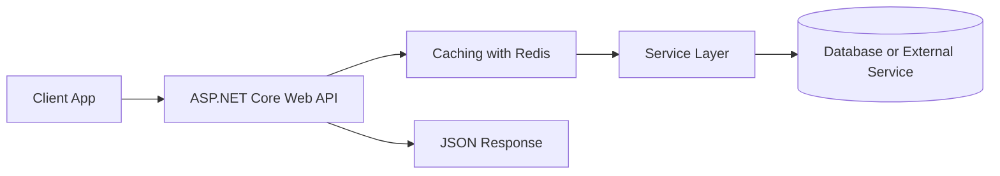

# Caching with Redis

## Learning Goal
Improve read performance using distributed cache.

## Simple Explanation
Redis stores frequently requested data outside the database for fast access.

ASP.NET Core Web API in .NET 10 is used to build HTTP services that can be consumed by web apps, mobile apps, desktop apps, and other systems. Think in small responsibilities: request comes in, the API validates it, business logic runs, data is read or changed, and a clear JSON response goes back.

বাংলা সারাংশ: এই পাঠটি সহজভাবে ধারণা, ব্যবহার, ভুল এবং বাস্তব অনুশীলন বুঝতে সাহায্য করবে।

## Real-world Example
Department list is cached because it changes rarely.

In an Employee Management API, this topic helps you design endpoints that are easy for frontend developers, mobile apps, and other services to consume.

## Code Example
```csharp
builder.Services.AddStackExchangeRedisCache(options =>
{
    options.Configuration = builder.Configuration.GetConnectionString("Redis");
});

public async Task<IReadOnlyList<DepartmentResponse>> GetDepartmentsAsync()
{
    var cached = await cache.GetStringAsync("departments:all");
    if (cached is not null) return JsonSerializer.Deserialize<List<DepartmentResponse>>(cached)!;

    var departments = await repository.GetAllAsync();
    await cache.SetStringAsync("departments:all", JsonSerializer.Serialize(departments));
    return departments;
}
```

## Common Mistakes
- Putting business logic directly inside controllers.
- Returning database entities directly from public API endpoints.
- Ignoring HTTP status codes and always returning `200 OK`.
- Hardcoding settings that should come from configuration.

## Best Practices
- Keep controllers thin and move rules to services or handlers.
- Use DTOs for request and response contracts.
- Return meaningful status codes such as `200`, `201`, `400`, `401`, `403`, `404`, and `500`.
- Keep secrets out of source code and use environment-specific configuration.

## Practice Task
Create a small example for this topic in an Employee Management API. Write the endpoint name, request body, response body, and the service method that would handle it.

## Mermaid Diagram


## Quick Check
- Can you explain this topic in one minute?
- Can you show where it belongs in a real API?
- Can you name one mistake and one best practice?
