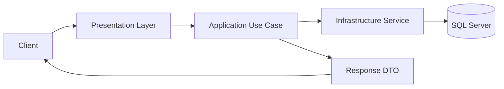
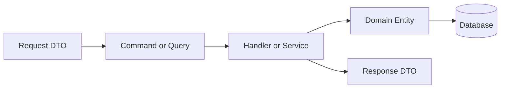
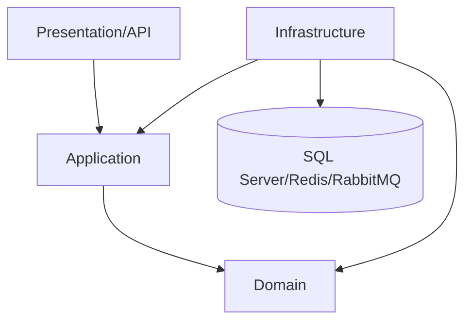
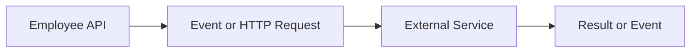
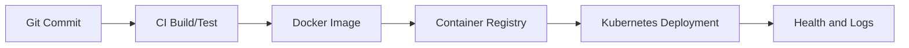
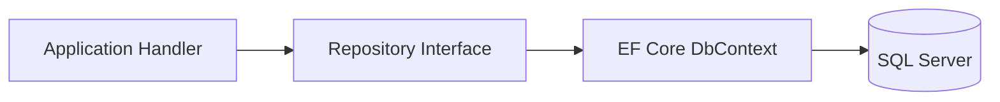
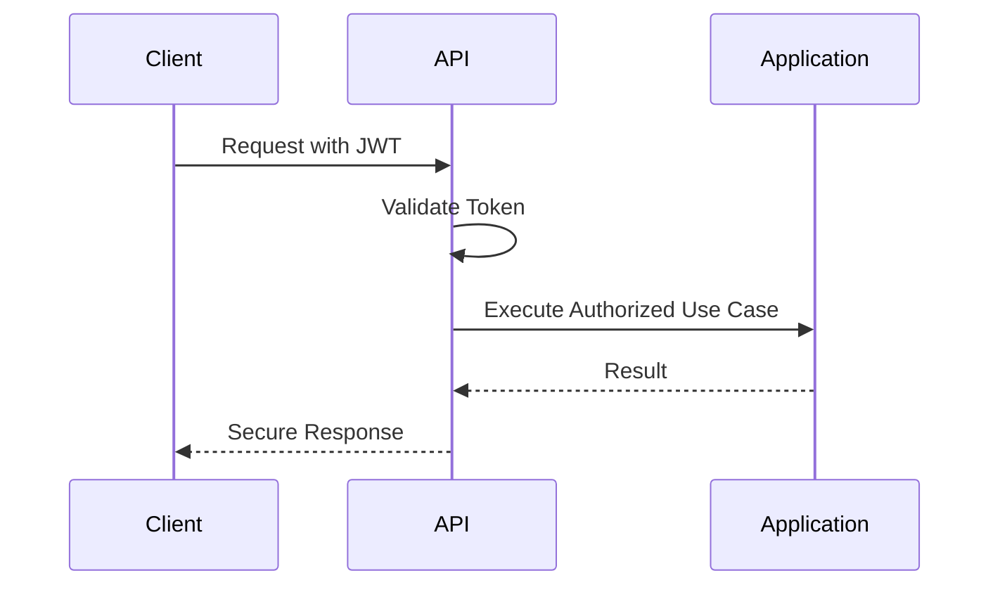

# Lesson 05: Redis Caching

[Previous: Lesson 04 - Unit of Work](lesson-04-unit-of-work.md) | [Next: Lesson 06 - Background Services](lesson-06-background-services.md)

## Lesson Overview
This advanced lesson explains **Redis Caching** for ASP.NET Core Web API using .NET 10. The focus is production-grade thinking for senior developers, solution architects, technical leads, and enterprise application developers.

বাংলা সারাংশ: এই advanced পাঠটি আপনাকে senior developer, solution architect এবং technical lead হিসেবে চিন্তা করতে শেখাবে। ধারণা, architecture, security, performance এবং production flow ধীরে ধীরে অনুশীলন করুন।

## Learning Objectives
- Understand the purpose of Redis Caching in enterprise Web API systems.
- Place the concept correctly in Clean Architecture layers.
- Use EF Core, SQL Server, configuration, and production practices responsibly.
- Identify security, performance, deployment, and operational concerns.
- Explain the topic clearly in interviews and design discussions.

বাংলা সারাংশ: এই advanced পাঠটি আপনাকে senior developer, solution architect এবং technical lead হিসেবে চিন্তা করতে শেখাবে। ধারণা, architecture, security, performance এবং production flow ধীরে ধীরে অনুশীলন করুন।

## Prerequisites
- ASP.NET Core Web API basics.
- Dependency Injection, middleware, DTOs, and controllers.
- EF Core and SQL Server basics.
- Basic understanding of authentication, logging, and deployment.

বাংলা সারাংশ: এই advanced পাঠটি আপনাকে senior developer, solution architect এবং technical lead হিসেবে চিন্তা করতে শেখাবে। ধারণা, architecture, security, performance এবং production flow ধীরে ধীরে অনুশীলন করুন।

## Real World Problem
An Employee Management API starts simple, but as teams, users, modules, data volume, and deployment complexity grow, the project needs clear boundaries, reliable operations, secure communication, and predictable performance. **Redis Caching** helps solve one important part of that enterprise growth problem.

বাংলা সারাংশ: এই advanced পাঠটি আপনাকে senior developer, solution architect এবং technical lead হিসেবে চিন্তা করতে শেখাবে। ধারণা, architecture, security, performance এবং production flow ধীরে ধীরে অনুশীলন করুন।

## Theory Explanation
Use Redis to reduce database load and speed up frequently requested API data. The theory is not only about syntax. It is about controlling dependencies, making behavior explicit, reducing coupling, and making the system easier to test, deploy, observe, and change.

বাংলা সারাংশ: এই advanced পাঠটি আপনাকে senior developer, solution architect এবং technical lead হিসেবে চিন্তা করতে শেখাবে। ধারণা, architecture, security, performance এবং production flow ধীরে ধীরে অনুশীলন করুন।

## Beginner Explanation
Think of Redis Caching as a rule or tool that keeps a large API organized. It helps you avoid putting everything inside controllers and makes each part of the system easier to understand.

বাংলা সারাংশ: এই advanced পাঠটি আপনাকে senior developer, solution architect এবং technical lead হিসেবে চিন্তা করতে শেখাবে। ধারণা, architecture, security, performance এবং production flow ধীরে ধীরে অনুশীলন করুন।

## Intermediate Explanation
At intermediate level, Redis Caching connects controllers, services, repositories, EF Core, SQL Server, configuration, and external systems with clearer responsibilities. It helps you decide where code belongs.

বাংলা সারাংশ: এই advanced পাঠটি আপনাকে senior developer, solution architect এবং technical lead হিসেবে চিন্তা করতে শেখাবে। ধারণা, architecture, security, performance এবং production flow ধীরে ধীরে অনুশীলন করুন।

## Advanced Explanation
At advanced level, Redis Caching affects architecture boundaries, transaction behavior, failure handling, scale, observability, security posture, deployment strategy, and team ownership. Senior engineers evaluate trade-offs instead of applying patterns blindly.

বাংলা সারাংশ: এই advanced পাঠটি আপনাকে senior developer, solution architect এবং technical lead হিসেবে চিন্তা করতে শেখাবে। ধারণা, architecture, security, performance এবং production flow ধীরে ধীরে অনুশীলন করুন।

## Bangla Summary
বাংলা সারাংশ: এই advanced পাঠটি আপনাকে senior developer, solution architect এবং technical lead হিসেবে চিন্তা করতে শেখাবে। ধারণা, architecture, security, performance এবং production flow ধীরে ধীরে অনুশীলন করুন।

## Architecture Discussion
In Clean Architecture, the API layer should not own business rules. The Application layer owns use cases. The Domain layer owns core rules. The Infrastructure layer implements EF Core, SQL Server, Redis, RabbitMQ, Docker, Kubernetes, and external services. Redis Caching should be placed where it supports this dependency direction.

বাংলা সারাংশ: এই advanced পাঠটি আপনাকে senior developer, solution architect এবং technical lead হিসেবে চিন্তা করতে শেখাবে। ধারণা, architecture, security, performance এবং production flow ধীরে ধীরে অনুশীলন করুন।

## Complete Flow Explanation
1. Client sends an HTTP request.
2. Middleware handles cross-cutting concerns such as errors, authentication, rate limiting, and logging.
3. API endpoint maps the request to a DTO, command, or query.
4. Application layer executes the use case.
5. Infrastructure layer handles database, cache, queue, file, or external communication.
6. The API returns a consistent response DTO and status code.

বাংলা সারাংশ: এই advanced পাঠটি আপনাকে senior developer, solution architect এবং technical lead হিসেবে চিন্তা করতে শেখাবে। ধারণা, architecture, security, performance এবং production flow ধীরে ধীরে অনুশীলন করুন।

## Request Lifecycle
A production request should pass through HTTPS, exception handling, authentication, authorization, validation, use case execution, data access, logging, and response formatting. Redis Caching must not break this flow.

বাংলা সারাংশ: এই advanced পাঠটি আপনাকে senior developer, solution architect এবং technical lead হিসেবে চিন্তা করতে শেখাবে। ধারণা, architecture, security, performance এবং production flow ধীরে ধীরে অনুশীলন করুন।

## Database Interaction Flow
EF Core should access SQL Server through a clear boundary. Use repositories, DbContext, or query services intentionally. Keep transaction scope, query performance, indexes, and DTO projection in mind.

বাংলা সারাংশ: এই advanced পাঠটি আপনাকে senior developer, solution architect এবং technical lead হিসেবে চিন্তা করতে শেখাবে। ধারণা, architecture, security, performance এবং production flow ধীরে ধীরে অনুশীলন করুন।

## Security Considerations
- Enforce HTTPS.
- Validate input before business execution.
- Protect sensitive endpoints with JWT and authorization policies.
- Store secrets outside source control.
- Avoid leaking stack traces or internal data.
- Audit important business actions.

বাংলা সারাংশ: এই advanced পাঠটি আপনাকে senior developer, solution architect এবং technical lead হিসেবে চিন্তা করতে শেখাবে। ধারণা, architecture, security, performance এবং production flow ধীরে ধীরে অনুশীলন করুন।

## Performance Considerations
- Use async/await for IO operations.
- Avoid loading unnecessary columns or relationships.
- Add pagination to list endpoints.
- Use caching for stable read-heavy data.
- Monitor slow queries, memory usage, and downstream latency.

বাংলা সারাংশ: এই advanced পাঠটি আপনাকে senior developer, solution architect এবং technical lead হিসেবে চিন্তা করতে শেখাবে। ধারণা, architecture, security, performance এবং production flow ধীরে ধীরে অনুশীলন করুন।

## Special Deep Dive: Redis Caching
### Distributed Cache
Distributed Cache is an important production concept for this lesson. In a clean architecture API, decide which layer owns it, which interface hides it, how it is tested, and how it behaves in production.

### Cache Aside Pattern
Cache Aside Pattern is an important production concept for this lesson. In a clean architecture API, decide which layer owns it, which interface hides it, how it is tested, and how it behaves in production.

### Cache Invalidation
Cache Invalidation is an important production concept for this lesson. In a clean architecture API, decide which layer owns it, which interface hides it, how it is tested, and how it behaves in production.


## Folder Structure Example
```text
src/
  Employee.Api/
    Controllers/
    Program.cs
  Employee.Application/
    Employees/
    Common/Interfaces/
  Employee.Domain/
    Entities/
    ValueObjects/
  Employee.Infrastructure/
    Persistence/
    Caching/
    Messaging/
  Employee.Tests/
    Unit/
    Integration/
```

## Code Example
```csharp
builder.Services.AddStackExchangeRedisCache(options =>
{
    options.Configuration = builder.Configuration.GetConnectionString("Redis");
    options.InstanceName = "employee-api:";
});

app.MapGet("/api/departments", async (IDistributedCache cache, AppDbContext db, CancellationToken ct) =>
{
    const string cacheKey = "departments:list";
    var cached = await cache.GetStringAsync(cacheKey, ct);
    if (cached is not null) return Results.Content(cached, "application/json");

    var departments = await db.Departments.AsNoTracking().Select(x => new { x.Id, x.Name }).ToListAsync(ct);
    var json = JsonSerializer.Serialize(departments);
    await cache.SetStringAsync(cacheKey, json, new DistributedCacheEntryOptions
    {
        AbsoluteExpirationRelativeToNow = TimeSpan.FromMinutes(10)
    }, ct);
    return Results.Json(departments);
});
```

বাংলা সারাংশ: এই advanced পাঠটি আপনাকে senior developer, solution architect এবং technical lead হিসেবে চিন্তা করতে শেখাবে। ধারণা, architecture, security, performance এবং production flow ধীরে ধীরে অনুশীলন করুন।

## Configuration Example
```json
{
  "ConnectionStrings": {
    "DefaultConnection": "Server=sql-server;Database=EmployeeDb;User Id=app;Password=strong-password;TrustServerCertificate=True",
    "Redis": "redis:6379"
  },
  "Jwt": {
    "Issuer": "EmployeeApi",
    "Audience": "EmployeeClient"
  },
  "RabbitMq": {
    "Host": "rabbitmq",
    "Exchange": "employee.events"
  }
}
```

## Production Example
In production, Redis Caching should be monitored with logs, health checks, metrics, alerts, secure secrets, environment-specific configuration, and automated deployment. A senior developer also documents operational behavior and rollback strategy.

বাংলা সারাংশ: এই advanced পাঠটি আপনাকে senior developer, solution architect এবং technical lead হিসেবে চিন্তা করতে শেখাবে। ধারণা, architecture, security, performance এবং production flow ধীরে ধীরে অনুশীলন করুন।

## Mermaid Diagrams

### Request Flow


### Data Flow


### Architecture Flow


### Service Communication


### Deployment Flow


### Database Interaction


### Authentication Flow



## Common Mistakes
- Applying patterns without a real problem.
- Mixing controller, business, data access, and infrastructure responsibilities.
- Ignoring transactions, retries, timeouts, and failure modes.
- Forgetting security and observability until production.
- Returning database entities directly from public APIs.

বাংলা সারাংশ: এই advanced পাঠটি আপনাকে senior developer, solution architect এবং technical lead হিসেবে চিন্তা করতে শেখাবে। ধারণা, architecture, security, performance এবং production flow ধীরে ধীরে অনুশীলন করুন।

## Best Practices
- Keep dependencies pointing inward.
- Use DTOs at API boundaries.
- Keep use cases small and testable.
- Treat database, cache, queue, and external services as infrastructure details.
- Document production behavior, failure handling, and monitoring.

বাংলা সারাংশ: এই advanced পাঠটি আপনাকে senior developer, solution architect এবং technical lead হিসেবে চিন্তা করতে শেখাবে। ধারণা, architecture, security, performance এবং production flow ধীরে ধীরে অনুশীলন করুন।

## Interview Questions
1. What problem does Redis Caching solve in a large ASP.NET Core Web API?
2. Which Clean Architecture layer should own this concern?
3. How does this topic affect testing and maintainability?
4. What are the production risks if this is implemented badly?
5. How would you explain this to a junior developer?

## Hands-on Exercises
- Draw the request flow for Redis Caching in an Employee Management API.
- Write one endpoint that uses the concept safely.
- Identify one security risk and one performance risk.
- Add logging around the important operation.

## Mini Project Task
Apply Redis Caching to the Employee Management API. Create a small design note with folder location, interfaces, DTOs, configuration, expected errors, logs, and deployment considerations.

## Learning Checklist
- [ ] I can explain Redis Caching in simple words.
- [ ] I know where it belongs in Clean Architecture.
- [ ] I can write a .NET 10 Web API example.
- [ ] I understand EF Core and SQL Server impact.
- [ ] I can discuss security and performance trade-offs.
- [ ] I can answer interview questions about this topic.

[Previous: Lesson 04 - Unit of Work](lesson-04-unit-of-work.md) | [Next: Lesson 06 - Background Services](lesson-06-background-services.md)
