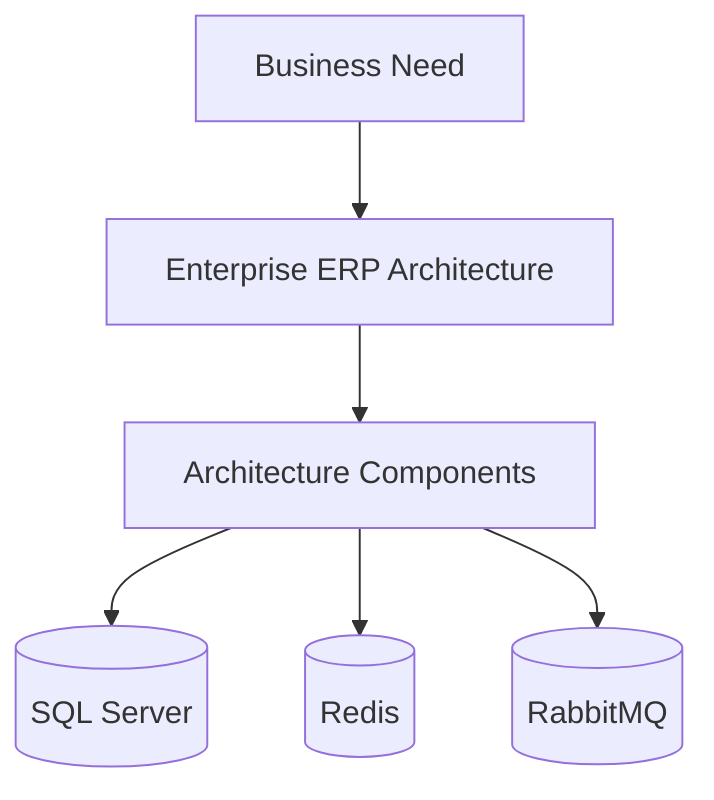
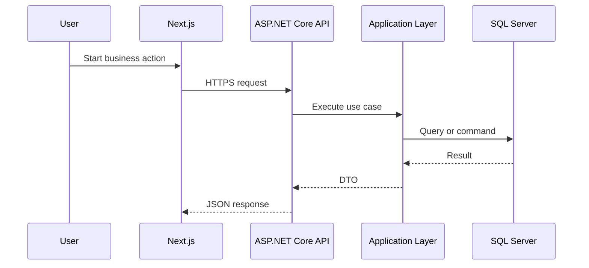
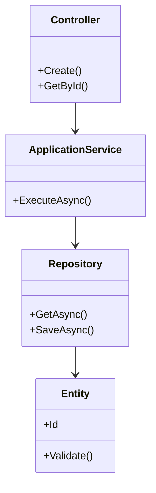
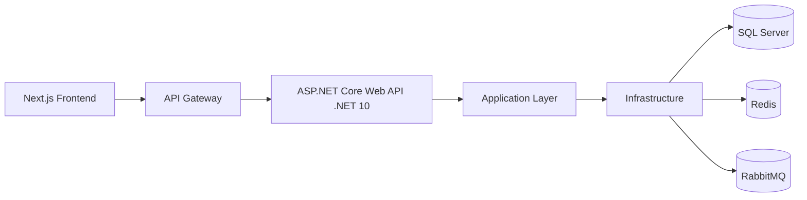
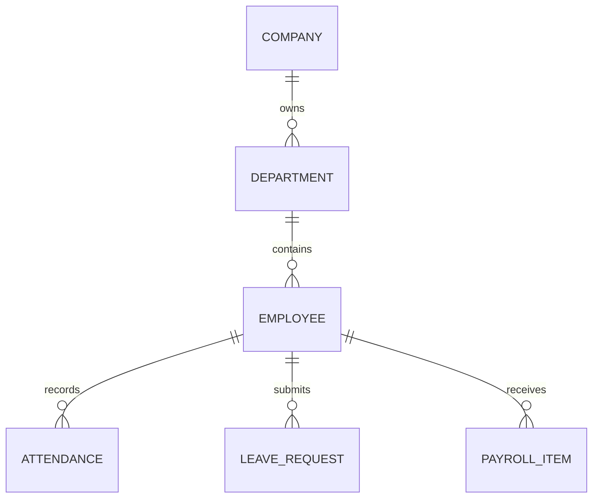
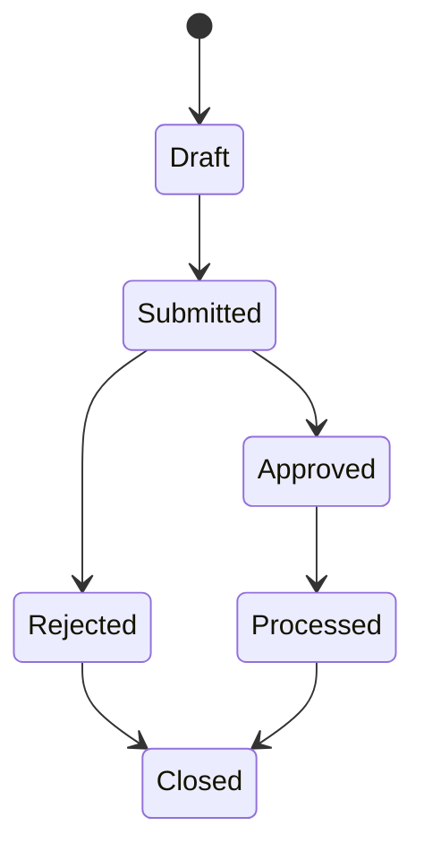
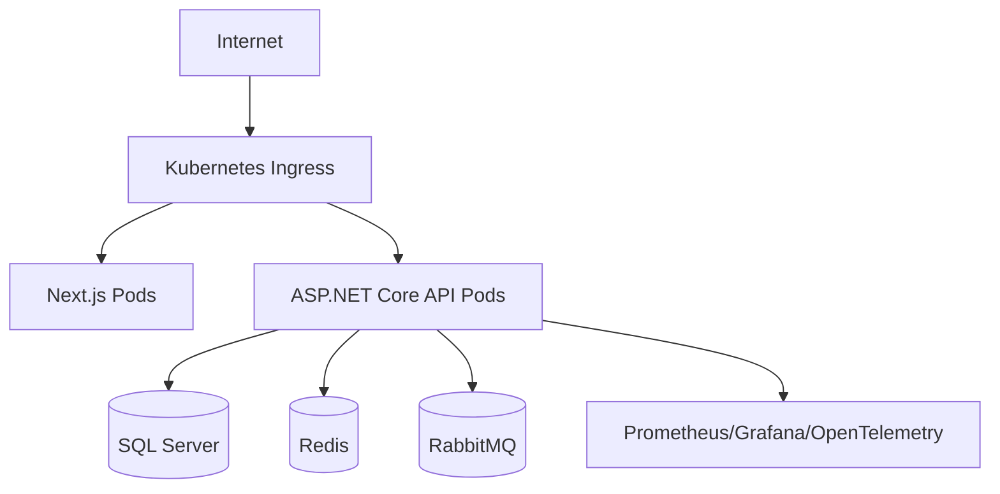
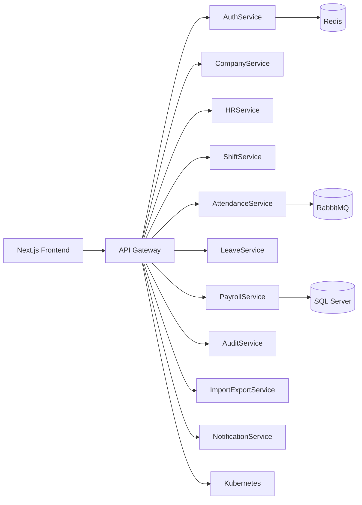

```mermaid
flowchart LR
    Next[Next.js Frontend] --> Gateway[API Gateway]
    Gateway --> Auth[AuthService]
    Gateway --> Company[CompanyService]
    Gateway --> HR[HRService]
    Gateway --> Shift[ShiftService]
    Gateway --> Attendance[AttendanceService]
    Gateway --> Leave[LeaveService]
    Gateway --> Payroll[PayrollService]
    Gateway --> Audit[AuditService]
    Gateway --> ImportExport[ImportExportService]
    Gateway --> Notification[NotificationService]
    Attendance --> Rabbit[(RabbitMQ)]
    Payroll --> SQL[(SQL Server)]
    Auth --> Redis[(Redis)]
    Gateway --> K8s[Kubernetes]
```

# Architecture 15: Enterprise ERP Architecture

## Overview
Enterprise ERP Architecture teaches architecture thinking for ASP.NET Core Web API (.NET 10), SQL Server, Redis, RabbitMQ, Docker, Kubernetes, and enterprise systems.

## Business Problem
Large systems become difficult when modules, data, security, deployment, and integrations are not designed clearly. Architecture gives teams shared direction.

## Architecture Goal
Create a maintainable, secure, scalable, observable, and deployable design that can grow from a small API to an enterprise platform.

## Real-world Example
An ERP platform has Auth, Company, HR, Shift, Attendance, Leave, Payroll, Audit, Import/Export, and Notification capabilities. Each needs clear contracts and data ownership.

## Design Principles
- Separate concerns by business capability.
- Keep dependencies stable and intentional.
- Prefer explicit contracts.
- Design for failure, recovery, and observability.
- Secure every boundary.

## Component Breakdown
- Frontend: Next.js.
- Backend: ASP.NET Core Web API (.NET 10).
- Database: SQL Server.
- Infrastructure: Redis, RabbitMQ, Docker, Kubernetes.
- Cross-cutting: logging, metrics, tracing, secrets, CI/CD.

## Advantages
- Clear ownership.
- Better maintainability.
- Easier scaling path.
- Stronger security review.
- Better production readiness.

## Disadvantages
- More upfront design.
- More documentation to maintain.
- Risk of over-engineering.
- Requires team discipline.

## Scalability Discussion
Scale API pods horizontally, optimize SQL Server indexes, use Redis for read-heavy data, RabbitMQ for asynchronous workflows, and Kubernetes for controlled deployment.

## Security Considerations
Use HTTPS, JWT/OAuth2/OpenID Connect, RBAC/ABAC, secret management, input validation, audit logs, and least privilege access.

## Performance Considerations
Use async IO, pagination, projection, SQL indexes, caching, background processing, message queues, and continuous monitoring.

## Common Mistakes
- Choosing microservices too early.
- Ignoring data ownership.
- Mixing business rules with infrastructure.
- Forgetting observability.
- Designing without deployment reality.

## Best Practices
- Start with business capabilities.
- Use diagrams as decision records.
- Review architecture regularly.
- Keep APIs and data contracts stable.
- Measure production behavior.

## Enterprise Recommendations
Use modular monolith first unless service boundaries, team ownership, and deployment needs justify microservices. Standardize security, logging, deployment, and API contracts.

## Interview Questions
1. What problem does this architecture solve?
2. What trade-offs does it introduce?
3. How does it scale?
4. How is it secured?
5. How would you review it before production?

## Architecture Review Checklist
- [ ] Business capabilities are clear.
- [ ] Data ownership is defined.
- [ ] Security boundaries are documented.
- [ ] Diagrams match the written design.
- [ ] Deployment and rollback are planned.
- [ ] Logs, metrics, and traces are included.

## Deep Dive Requirements
### Next.js
Next.js must be designed with ownership, failure handling, security, monitoring, and deployment impact in mind. Document the decision, trade-offs, and operational expectations before implementation.

### ASP.NET Core Web API .NET 10
ASP.NET Core Web API .NET 10 must be designed with ownership, failure handling, security, monitoring, and deployment impact in mind. Document the decision, trade-offs, and operational expectations before implementation.

### SQL Server
SQL Server must be designed with ownership, failure handling, security, monitoring, and deployment impact in mind. Document the decision, trade-offs, and operational expectations before implementation.

### Redis
Redis must be designed with ownership, failure handling, security, monitoring, and deployment impact in mind. Document the decision, trade-offs, and operational expectations before implementation.

### RabbitMQ
RabbitMQ must be designed with ownership, failure handling, security, monitoring, and deployment impact in mind. Document the decision, trade-offs, and operational expectations before implementation.

### Docker
Docker must be designed with ownership, failure handling, security, monitoring, and deployment impact in mind. Document the decision, trade-offs, and operational expectations before implementation.

### Kubernetes
Kubernetes must be designed with ownership, failure handling, security, monitoring, and deployment impact in mind. Document the decision, trade-offs, and operational expectations before implementation.

### AuthService
AuthService must be designed with ownership, failure handling, security, monitoring, and deployment impact in mind. Document the decision, trade-offs, and operational expectations before implementation.

### CompanyService
CompanyService must be designed with ownership, failure handling, security, monitoring, and deployment impact in mind. Document the decision, trade-offs, and operational expectations before implementation.

### HRService
HRService must be designed with ownership, failure handling, security, monitoring, and deployment impact in mind. Document the decision, trade-offs, and operational expectations before implementation.

### ShiftService
ShiftService must be designed with ownership, failure handling, security, monitoring, and deployment impact in mind. Document the decision, trade-offs, and operational expectations before implementation.

### AttendanceService
AttendanceService must be designed with ownership, failure handling, security, monitoring, and deployment impact in mind. Document the decision, trade-offs, and operational expectations before implementation.

### LeaveService
LeaveService must be designed with ownership, failure handling, security, monitoring, and deployment impact in mind. Document the decision, trade-offs, and operational expectations before implementation.

### PayrollService
PayrollService must be designed with ownership, failure handling, security, monitoring, and deployment impact in mind. Document the decision, trade-offs, and operational expectations before implementation.

### AuditService
AuditService must be designed with ownership, failure handling, security, monitoring, and deployment impact in mind. Document the decision, trade-offs, and operational expectations before implementation.

### ImportExportService
ImportExportService must be designed with ownership, failure handling, security, monitoring, and deployment impact in mind. Document the decision, trade-offs, and operational expectations before implementation.

### NotificationService
NotificationService must be designed with ownership, failure handling, security, monitoring, and deployment impact in mind. Document the decision, trade-offs, and operational expectations before implementation.

## Mermaid Diagrams

### Flowchart

### Sequence Diagram

### Class Diagram

### Component Diagram

### Entity Relationship Diagram ERD

### State Diagram

### Deployment Diagram

## Enterprise ERP Required Diagrams
### System Context Diagram

### Container Diagram

### Component Diagram

### Service Communication Diagram

### Database Diagram

### Authentication Flow

### Attendance Processing Flow

### Payroll Processing Flow

### Import Processing Flow

### Deployment Diagram

