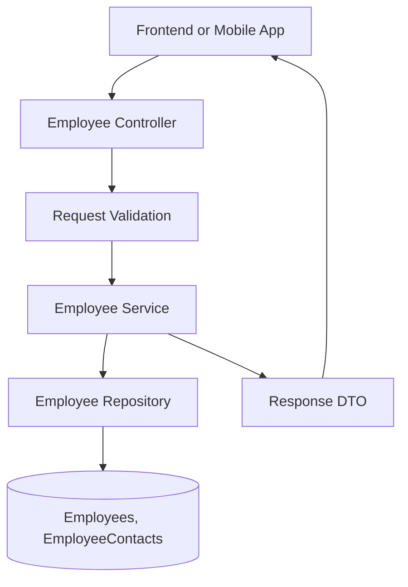

# Employee Management API - Employee Module

## Learning Goal
Design the Employee module of a real-world Employee Management API from features to endpoints, database ideas, validation, service flow, and diagrams.

## Simple Explanation
The Employee module is one business area of the Employee Management API. A strong API design starts with user needs, then turns them into endpoints, tables, request/response DTOs, validation rules, and service logic.

বাংলা সারাংশ: এই পাঠটি সহজভাবে ধারণা, ব্যবহার, ভুল এবং বাস্তব অনুশীলন বুঝতে সাহায্য করবে।

## Feature List
- Create employee
- Update profile
- Search employees
- Deactivate employee

## API Endpoint List
- `/api/employees`
- `/api/employees/{id}`
- `/api/employees/search`
- `/api/employees/{id}/deactivate`

## Database Table Idea
- `Employees`: stores employees data.
- `EmployeeContacts`: stores employeecontacts data.

## Request/Response Example
Request:
```json
{
  "name": "Rahim Uddin",
  "departmentId": 2
}
```

Response:
```json
{
  "id": 1,
  "message": "Operation completed successfully"
}
```

## Validation Rules
- Required fields must not be empty.
- Text fields should have maximum length limits.
- Foreign keys must reference existing records.
- Business rules should be checked in the service layer.
- Unauthorized users must not access protected module operations.

## Service Flow
1. Controller receives request DTO.
2. Validator checks shape and basic rules.
3. Service checks business rules and permissions.
4. Repository reads or writes database records.
5. Service returns response DTO.
6. Controller returns the correct HTTP status code.

## Simple Explanation
For this module, keep controller code small. The service should own the business decision, and the repository should own data access. This separation makes the project easier to test and maintain.

## Real-world Example
In a company HR system, the Employee module supports daily HR operations while keeping employee data consistent and auditable.

## Code Example
```csharp
[ApiController]
[Route("api/employee")]
public sealed class EmployeeController : ControllerBase
{
    private readonly IEmployeeService service;

    public EmployeeController(IEmployeeService service)
    {
        this.service = service;
    }

    [HttpPost]
    public async Task<IActionResult> Create(CreateEmployeeRequest request)
    {
        var result = await service.CreateAsync(request);
        return CreatedAtAction(nameof(Create), result);
    }
}
```

## Common Mistakes
- Designing endpoints before understanding the business workflow.
- Mixing unrelated module responsibilities in one controller.
- Skipping validation because the frontend already validates.
- Forgetting audit fields such as CreatedAt and UpdatedAt.

## Best Practices
- Keep module boundaries clear.
- Use request and response DTOs.
- Add indexes for common search fields.
- Log important business events.
- Write tests for service rules.

## Practice Task
Create one extra endpoint for the Employee module. Define the URL, HTTP method, request body, response body, validation rules, and service method name.

## Mermaid Diagram

