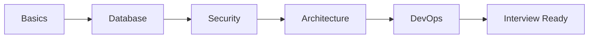

# ASP.NET Core Web API Interview Questions

## Learning Goal
Prepare for beginner to advanced ASP.NET Core Web API interviews using practical questions and concise answers.

## Simple Explanation
Interview preparation should connect concepts to real API design. Do not memorize only definitions; explain where each concept fits in a production API.

বাংলা সারাংশ: শুধু মুখস্থ না করে প্রতিটি প্রশ্নের বাস্তব ব্যবহার বুঝে উত্তর দিন।

## Real-world Example
If asked about middleware, explain authentication, error handling, logging, and routing in the request pipeline.

## Code Example
```csharp
app.UseExceptionHandler();
app.UseHttpsRedirection();
app.UseAuthentication();
app.UseAuthorization();
app.MapControllers();
```

## Common Mistakes
- Giving definitions without examples.
- Confusing authentication with authorization.
- Saying repository pattern is always required.
- Ignoring testing, logging, and deployment topics.

## Best Practices
- Answer with definition, reason, example, and trade-off.
- Mention status codes and API contracts.
- Explain security with practical habits.
- Use Employee Management API examples.

## Practice Task
Pick 10 questions and answer each in four lines: definition, use case, code or design example, and common mistake.

## Questions
1. What is ASP.NET Core Web API?
2. What is middleware?
3. What is dependency injection?
4. What is the difference between model and DTO?
5. What are common HTTP status codes?
6. How does JWT authentication work?
7. What is role-based authorization?
8. What is EF Core migration?
9. What is Clean Architecture?
10. What is CQRS?
11. Why use caching?
12. How do you handle global exceptions?
13. How do you secure connection strings?
14. What is API versioning?
15. How do health checks help deployment?

## Mermaid Diagram

