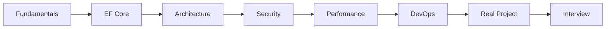

# ASP.NET Core Web API .NET 10 Learning Roadmap

## Learning Goal
Follow a clear path from beginner fundamentals to advanced real-world Web API design using .NET 10.

বাংলা সারাংশ: এই roadmap আপনাকে basic থেকে advanced ASP.NET Core Web API শেখার ধাপগুলো দেখাবে।

## Phase 1: Web API Fundamentals
Learn what Web API is, why it is used, HTTP basics, REST, JSON, controllers, routes, action methods, DTOs, middleware, error handling, and Swagger/OpenAPI.

বাংলা সারাংশ: এই roadmap আপনাকে basic থেকে advanced ASP.NET Core Web API শেখার ধাপগুলো দেখাবে।

### Practice
Design a simple `Employee` API endpoint list on paper:

```http
GET    /api/employees
GET    /api/employees/1
POST   /api/employees
PUT    /api/employees/1
DELETE /api/employees/1
```

## Phase 2: Database and EF Core
Learn Entity Framework Core, SQL Server connection strings, DbContext, entity classes, migrations, and basic database relationships.

বাংলা সারাংশ: এই roadmap আপনাকে basic থেকে advanced ASP.NET Core Web API শেখার ধাপগুলো দেখাবে।

## Phase 3: Clean Code and Architecture
Learn service layer, repository pattern, validation, DTO mapping, Clean Architecture, and project organization.

বাংলা সারাংশ: এই roadmap আপনাকে basic থেকে advanced ASP.NET Core Web API শেখার ধাপগুলো দেখাবে।

## Phase 4: Authentication and Security
Learn JWT authentication, role-based authorization, password security, secure configuration, and API protection.

বাংলা সারাংশ: এই roadmap আপনাকে basic থেকে advanced ASP.NET Core Web API শেখার ধাপগুলো দেখাবে।

## Phase 5: Advanced Performance
Learn pagination, filtering, searching, sorting, caching, async programming, rate limiting, logging, and performance optimization.

বাংলা সারাংশ: এই roadmap আপনাকে basic থেকে advanced ASP.NET Core Web API শেখার ধাপগুলো দেখাবে।

## Phase 6: Docker, Kubernetes, and DevOps
Learn Docker basics, container deployment, Kubernetes basic deployment, health checks, and CI/CD flow.

বাংলা সারাংশ: এই roadmap আপনাকে basic থেকে advanced ASP.NET Core Web API শেখার ধাপগুলো দেখাবে।

## Phase 7: Real-world Enterprise API Project
Design an Employee Management API with modules like Auth, Company, Employee, Department, Attendance, Leave, and Payroll.

বাংলা সারাংশ: এই roadmap আপনাকে basic থেকে advanced ASP.NET Core Web API শেখার ধাপগুলো দেখাবে।

## Phase 8: Interview Preparation
Prepare common ASP.NET Core Web API interview questions with short, practical, real-world answers.

বাংলা সারাংশ: এই roadmap আপনাকে basic থেকে advanced ASP.NET Core Web API শেখার ধাপগুলো দেখাবে।

## .NET 10 Learning Checkpoint Example
```csharp
app.MapGet("/api/learning/current-phase", () => new
{
    Phase = 1,
    Name = "Web API Fundamentals",
    Framework = ".NET 10"
});
```

## Mermaid Roadmap


## Practice Task
Create a 4-week study plan. Write which lessons you will read, which examples you will practice, and when you will revise.
