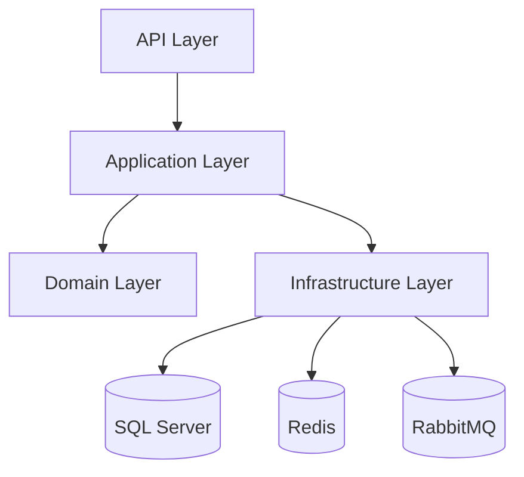

# Employee Management API Project Architecture

## Learning Goal
Understand how a professional Employee Management API can be organized without building the backend in this documentation project.

## Simple Explanation
The project architecture describes boundaries, layers, flows, and responsibilities. It is a blueprint for future implementation, not a running API.

বাংলা সারাংশ: এটি শুধু ডকুমেন্টেশন প্রজেক্ট; ভবিষ্যতে ব্যাকএন্ড তৈরির ব্লুপ্রিন্ট হিসেবে ব্যবহার করুন।

## Real-world Example
A company HR system uses Auth, Employee, Department, Attendance, Leave, and Payroll modules. Each module has endpoints, DTOs, validation, services, repositories, and database tables.

## Code Example
```text
Employee.Api              -> Controllers, middleware, filters
Employee.Application      -> Services, CQRS handlers, DTOs, validators
Employee.Domain           -> Entities, value objects, domain rules
Employee.Infrastructure   -> EF Core, repositories, Redis, RabbitMQ
Employee.Tests            -> Unit and integration tests
```

## Common Mistakes
- Letting controllers access DbContext directly in a large project.
- Placing EF Core attributes everywhere in domain entities without thinking.
- Creating microservices before module boundaries are stable.
- Ignoring transaction and consistency requirements.

## Best Practices
- Keep dependencies pointing inward.
- Use DTOs at API boundaries.
- Keep business rules close to application/domain layers.
- Use events for work that can happen asynchronously.
- Start modular, then split services only when there is a real need.

## Practice Task
Draw your own folder structure for the Employee Management API and decide which layer owns each class.

## Mermaid Diagram

