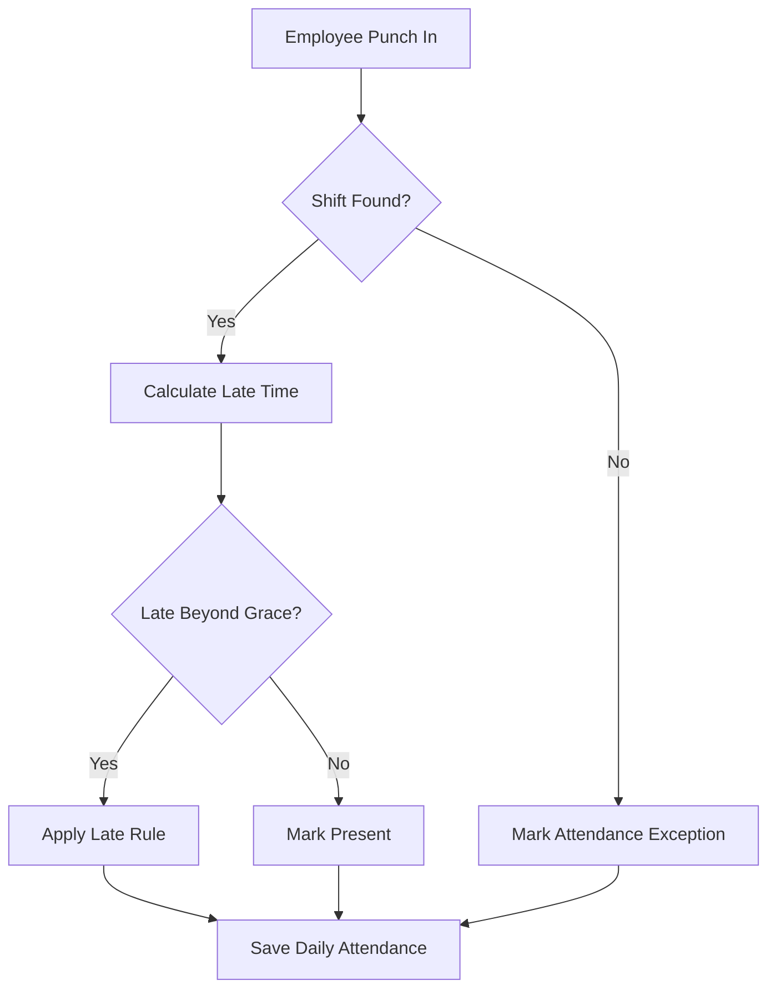

# Flow Chart

## Learning Objective
By the end of this lesson, you will read and create process diagrams that show actions, decisions, and outcomes.

## What is Flow Chart?
A flow chart shows the order of steps in a process. It uses boxes for actions, diamonds for decisions, and arrows for movement from one step to another.

## Why it is important?
ERP processes are rule-heavy. Flow charts make business rules visible before developers write code, especially for approval, attendance, payroll, purchasing, and inventory workflows.

## ERP Example
Attendance processing checks whether an employee has a valid shift. If a shift exists, the ERP calculates late time; otherwise it marks an exception for HR review.

## Step-by-step Explanation
1. Start with the business trigger.
2. Add each action in sequence.
3. Add decision points with yes/no paths.
4. Show exception paths clearly.
5. End with the saved ERP record or notification.

## Diagram

## Key Points
- Use one start point for simple flows.
- Every decision should have labeled outcomes.
- Exception paths are part of the real process.
- Flow charts are best for procedural logic.

## Common Mistakes
- Drawing too many details in one chart.
- Missing rejected, failed, or exception states.
- Using vague labels such as process data.
- Not validating the flow with business users.

## Practice Task
Draw a flow chart for leave request approval with balance validation, manager approval, HR update, and rejection path.

## Summary
Flow charts are the first practical tool for explaining business process logic.
