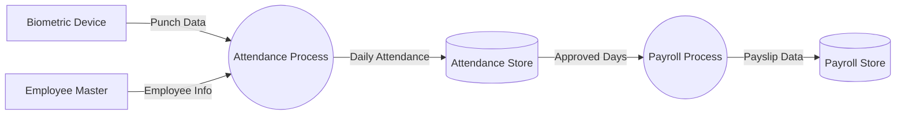

# Data Flow Diagram

## Learning Objective
By the end of this lesson, you will understand how data moves between users, processes, external systems, and data stores.

## What is Data Flow Diagram?
A Data Flow Diagram, or DFD, focuses on movement of data instead of step-by-step control logic. It shows external entities, processes, data stores, and data flows.

## Why it is important?
ERP systems depend on shared data. A DFD helps teams see where data comes from, which module transforms it, and where it is stored or reported.

## ERP Example
Biometric devices send punch data to Attendance. Attendance stores daily records. Payroll reads approved attendance to calculate salary.

## Step-by-step Explanation
1. Identify external entities such as employee, device, bank, or vendor.
2. Identify processes that transform data.
3. Identify data stores such as Employee Master or Attendance Ledger.
4. Draw arrows with meaningful data names.
5. Create a context diagram first, then add level details.

## Diagram

## Key Points
- DFD arrows represent data, not commands.
- Processes should transform input into output.
- Data stores should be named as business records.
- A context DFD shows the system boundary.

## Common Mistakes
- Using flow chart decisions inside a DFD.
- Drawing arrows without data names.
- Connecting external entities directly to databases.
- Skipping the system boundary.

## Practice Task
Create a level-0 DFD for purchase requisition from requester to approval, purchase order, inventory, and finance.

## Summary
DFDs teach you how ERP data travels across modules and reports.
