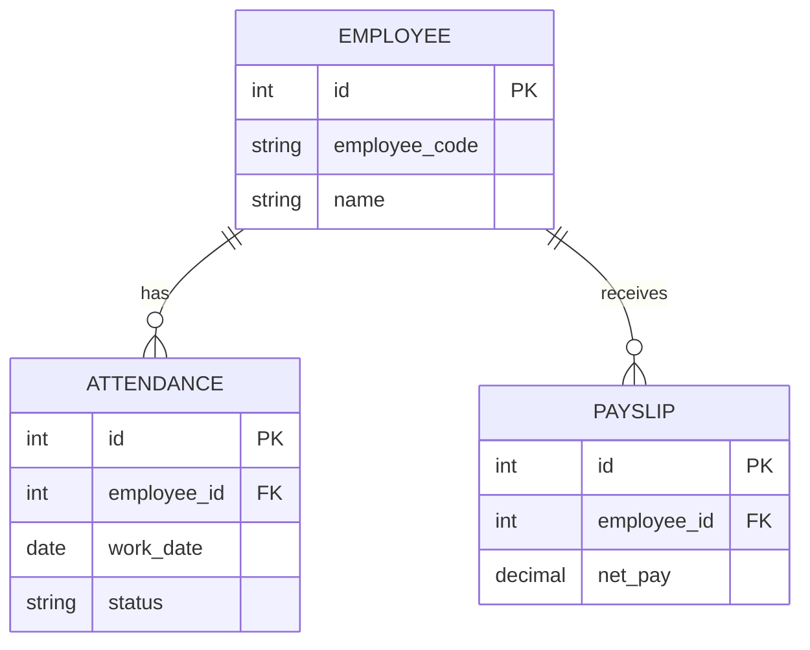

# Database Basic

## Learning Objective
By the end of this lesson, you will learn core database terms used in ERP documentation and development.

## What is Database Basic?
A database stores structured data in tables. Tables contain rows, columns, primary keys, foreign keys, constraints, and indexes.

## Why it is important?
ERP is data-centered software. Employee records, invoices, stock movements, vouchers, and approvals must be stored accurately and linked correctly.

## ERP Example
The Employee table stores employee master data. Attendance rows reference Employee by employee_id. Payroll rows use attendance and salary structure records.

## Step-by-step Explanation
1. Define one table for one business concept.
2. Choose a primary key for each table.
3. Use foreign keys to connect related records.
4. Add constraints for required and unique data.
5. Index columns used for search and reporting.

## Diagram

## Key Points
- Primary keys identify records.
- Foreign keys connect records.
- Constraints protect data quality.
- Indexes improve lookup speed.

## Common Mistakes
- Storing repeated values instead of using relationships.
- Using text names as keys instead of stable IDs.
- Allowing important fields to be empty.
- Ignoring audit columns such as created_by and updated_at.

## Practice Task
Design basic tables for Department, Employee, Shift, and Attendance with primary and foreign keys.

## Summary
Database basics are essential because every ERP process eventually creates, reads, updates, or reports data.
