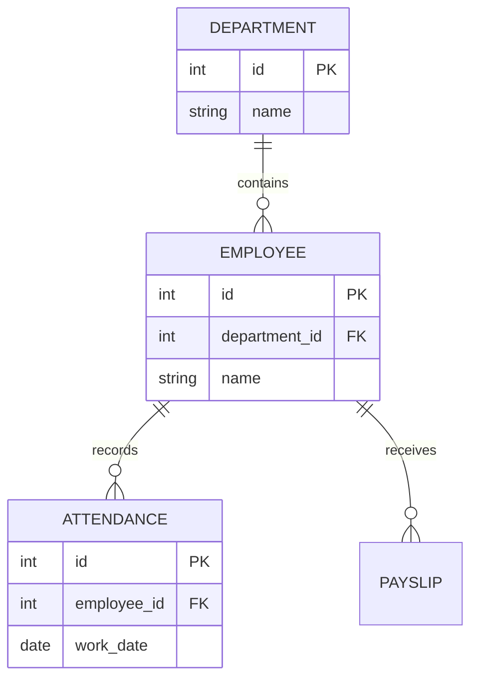

# ERD Basic

## Learning Objective
By the end of this lesson, you will model entities and relationships before creating database tables.

## What is ERD Basic?
An Entity Relationship Diagram shows business entities, their attributes, and how they relate to each other.

## Why it is important?
ERP modules share master data and transaction data. ERDs help prevent duplicate tables, broken relationships, and confusing ownership.

## ERP Example
One Department has many Employees. One Employee has many Attendance records. One Employee can have many Payslips.

## Step-by-step Explanation
1. Find business nouns such as Employee, Department, Invoice, or Item.
2. Add important attributes for each entity.
3. Decide relationship type: one-to-one, one-to-many, or many-to-many.
4. Resolve many-to-many relationships with bridge entities.
5. Review names with business users and developers.

## Diagram

## Key Points
- Entities become tables in most relational designs.
- Relationships explain business rules.
- Cardinality matters.
- Bridge tables solve many-to-many relationships.

## Common Mistakes
- Confusing screens with entities.
- Adding every possible field too early.
- Forgetting historical records.
- Not defining ownership of shared master data.

## Practice Task
Create an ERD for Customer, Sales Order, Sales Order Item, Product, Invoice, and Payment.

## Summary
ERDs are the foundation of reliable ERP data modeling.
