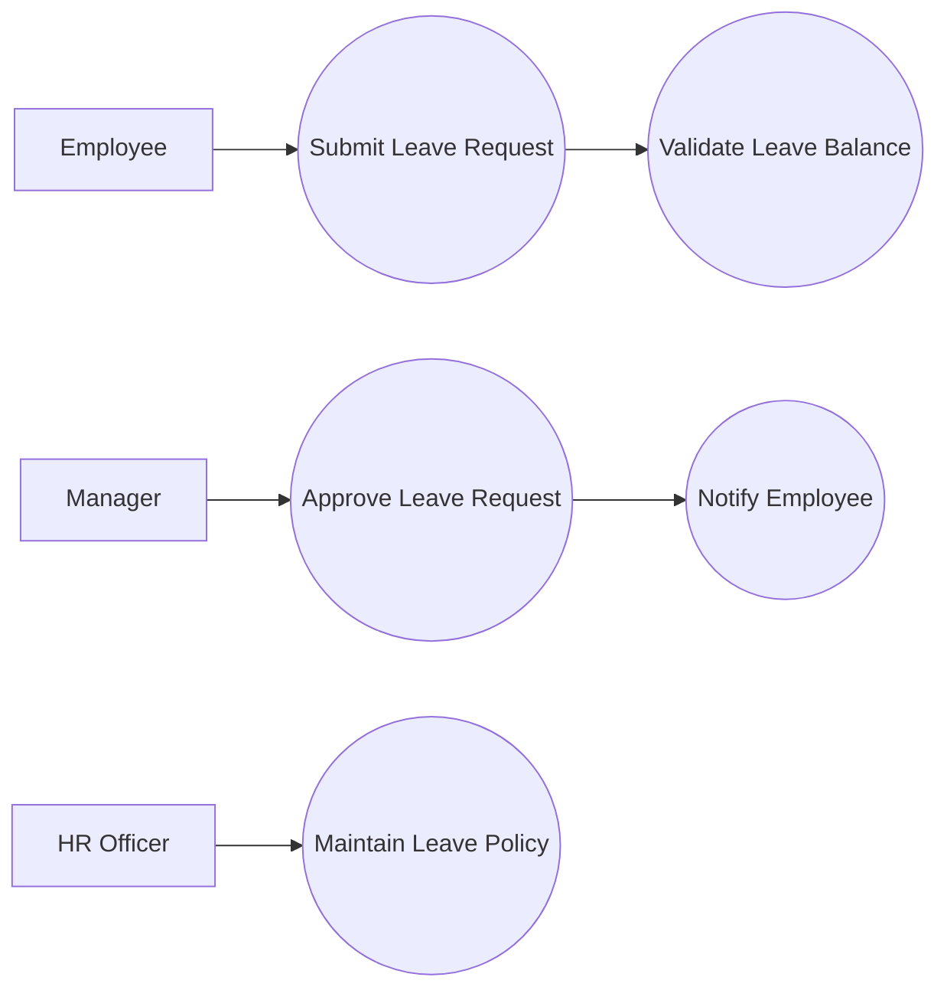

# Use Case Diagram

## Learning Objective
By the end of this lesson, you will define system scope by showing actors and their goals.

## What is Use Case Diagram?
A use case diagram shows who uses the system and what goals they perform. It does not show database details or internal code.

## Why it is important?
ERP projects often expand in scope. Use cases help teams agree which users can do which business actions.

## ERP Example
An Employee submits leave, a Manager approves leave, and HR updates leave policy. These are separate use cases with different permissions.

## Step-by-step Explanation
1. Define the system boundary.
2. List actors outside the system.
3. Write use cases as user goals.
4. Connect actors to their use cases.
5. Separate main use cases from optional or included behavior.

## Diagram

## Key Points
- Actors are roles, not always individual people.
- Use cases should be goal-oriented.
- The system boundary prevents scope confusion.
- Permissions can be discovered from use cases.

## Common Mistakes
- Writing technical functions instead of user goals.
- Putting database tables inside the diagram.
- Missing external systems as actors.
- Making one actor for every job title.

## Practice Task
Create a use case diagram for payroll processing with Employee, HR Officer, Payroll Manager, Finance, and Bank actors.

## Summary
Use case diagrams help define what the ERP must allow each role to accomplish.
