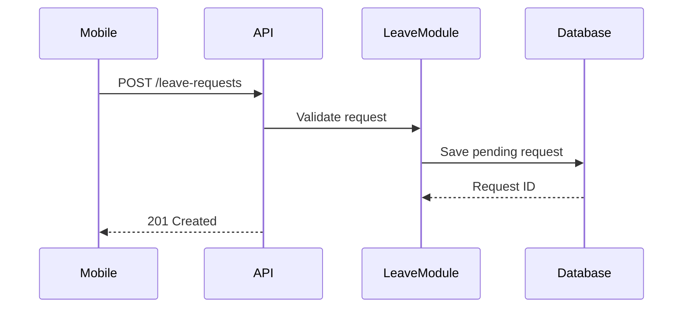

# API Basic

## Learning Objective
By the end of this lesson, you will understand how applications communicate through requests and responses.

## What is API Basic?
An API is a contract that lets one software component communicate with another. Web APIs often use HTTP methods, URLs, headers, request bodies, and response bodies.

## Why it is important?
ERP systems integrate with mobile apps, biometric devices, banks, e-commerce systems, SMS gateways, and reporting tools.

## ERP Example
A mobile app sends a POST request to create a leave request. The ERP API validates employee identity, leave balance, and policy rules before returning a result.

## Step-by-step Explanation
1. Identify the business resource.
2. Choose the HTTP method.
3. Define request fields.
4. Define response fields and status codes.
5. Document validation and error messages.

## Diagram

## Key Points
- GET reads data.
- POST creates data.
- PUT or PATCH updates data.
- Status codes and error messages are part of the contract.

## Common Mistakes
- Designing URLs around actions only.
- Returning unclear errors.
- Not documenting required fields.
- Ignoring API versioning and permissions.

## Practice Task
Write an API contract for creating a purchase requisition, including URL, method, request JSON, response JSON, and validation errors.

## Summary
API basics let you document integration points clearly before development starts.
