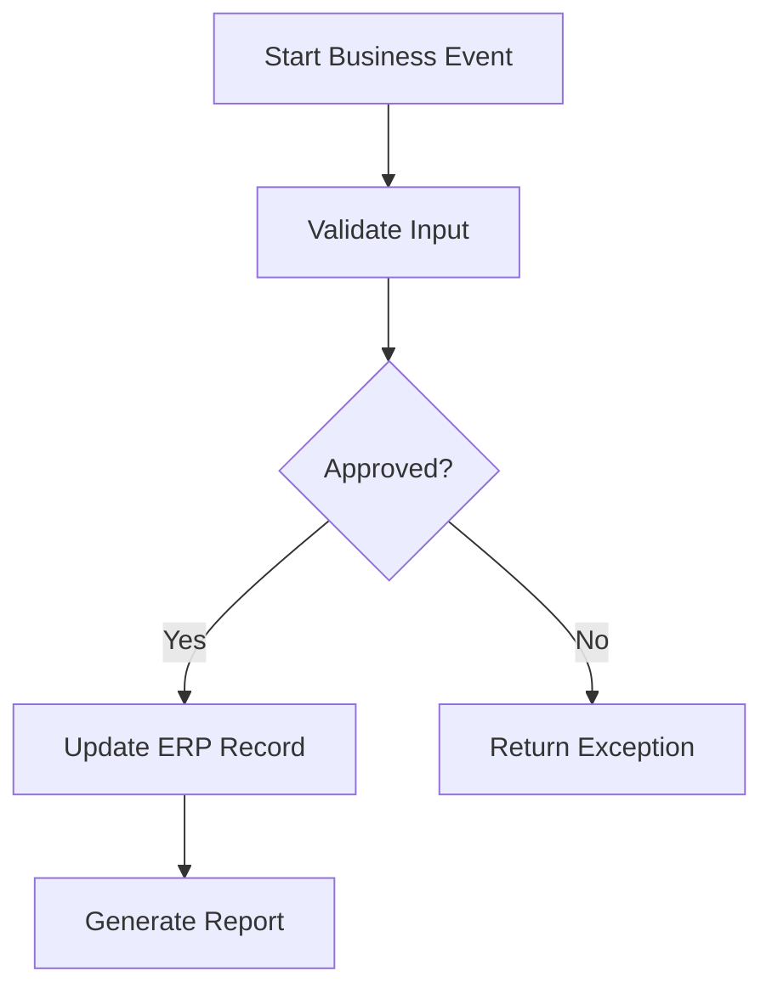

# Deployment Diagram Examples

## Learning Objective
By the end of this lesson, you will practice infrastructure diagrams for static, monolith, and enterprise deployments.

## What is Deployment Diagram Examples?
Deployment examples explain runtime nodes, network boundaries, databases, storage, and monitoring.

## Why it is important?
Diagram practice builds visual thinking. The goal is not to draw beautiful pictures; the goal is to explain a system clearly enough that business and technical people can agree.

## ERP Example
ERP deployment includes browser, CDN, load balancer, app server, database, queue, object storage, and log monitoring.

## Step-by-step Explanation
1. Choose the question the diagram must answer.
2. List the actors, modules, data, or infrastructure nodes.
3. Draw the simplest useful version first.
4. Add labels that explain real business meaning.
5. Review the diagram and remove unnecessary noise.

## Diagram

## Key Points
- Every diagram should answer one main question.
- Labels should use business language.
- Examples should include normal and exception paths.
- Diagrams improve when reviewed with real scenarios.

## Common Mistakes
- Adding too many unrelated concepts.
- Using generic names that hide meaning.
- Not showing where data is stored or changed.
- Skipping rejected and failed cases.

## Practice Task
Create your own Deployment Diagram Examples for an ERP module such as HR, Inventory, Sales, Finance, or Procurement.

## Summary
Deployment Diagram Examples gives you reusable visual patterns for documenting ERP systems.
