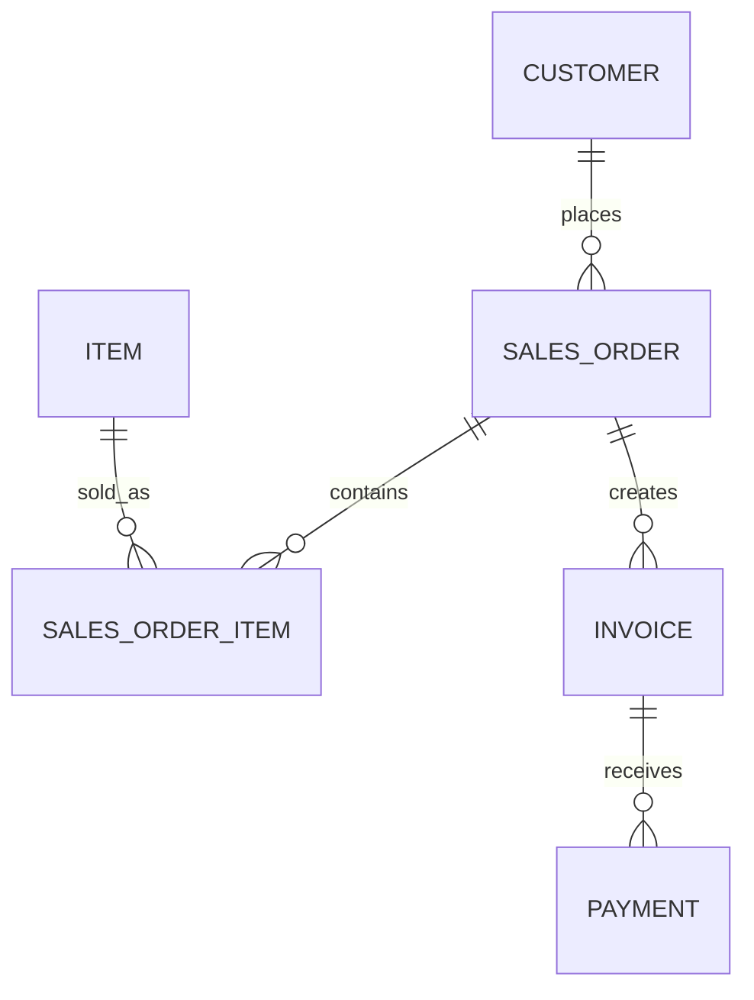

# ERD Examples

## Learning Objective
By the end of this lesson, you will practice entity relationship modeling for ERP modules.

## What is ERD Examples?
ERD examples teach how tables connect through primary keys, foreign keys, and cardinality.

## Why it is important?
Diagram practice builds visual thinking. The goal is not to draw beautiful pictures; the goal is to explain a system clearly enough that business and technical people can agree.

## ERP Example
Sales ERD connects Customer, SalesOrder, SalesOrderItem, Item, Invoice, and Payment.

## Step-by-step Explanation
1. Choose the question the diagram must answer.
2. List the actors, modules, data, or infrastructure nodes.
3. Draw the simplest useful version first.
4. Add labels that explain real business meaning.
5. Review the diagram and remove unnecessary noise.

## Diagram

## Key Points
- Every diagram should answer one main question.
- Labels should use business language.
- Examples should include normal and exception paths.
- Diagrams improve when reviewed with real scenarios.

## Common Mistakes
- Adding too many unrelated concepts.
- Using generic names that hide meaning.
- Not showing where data is stored or changed.
- Skipping rejected and failed cases.

## Practice Task
Create your own ERD Examples for an ERP module such as HR, Inventory, Sales, Finance, or Procurement.

## Summary
ERD Examples gives you reusable visual patterns for documenting ERP systems.
