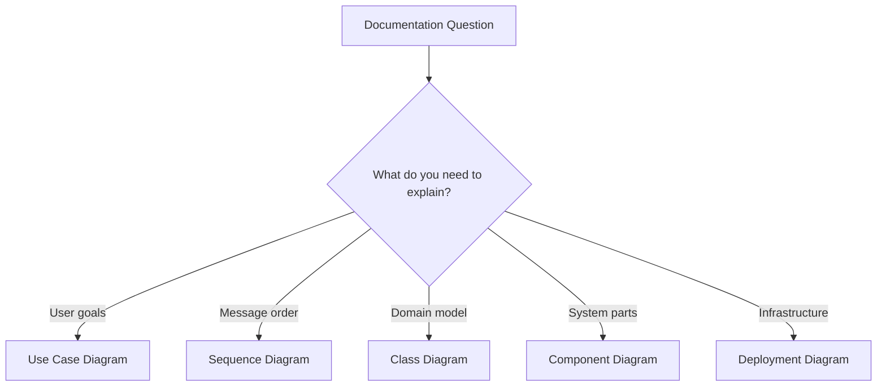

# UML Diagrams

## Learning Objective
By the end of this lesson, you will choose the right UML diagram for structure, behavior, and implementation planning.

## What is UML Diagrams?
UML is a standard visual language for modeling software. Common diagrams include use case, class, sequence, activity, component, deployment, and state diagrams.

## Why it is important?
ERP architecture needs multiple views. Business users need process views, developers need class and sequence views, and infrastructure teams need deployment views.

## ERP Example
A leave module can be described with use cases for scope, sequence diagrams for approval flow, class diagrams for domain rules, and deployment diagrams for hosting.

## Step-by-step Explanation
1. Decide the question the diagram must answer.
2. Use behavioral diagrams for workflows.
3. Use structural diagrams for modules, classes, and deployment.
4. Keep each diagram focused.
5. Link diagrams to requirements.

## Diagram

## Key Points
- No single diagram explains everything.
- UML helps different audiences understand different views.
- Use consistent names across diagrams.
- Keep diagrams connected to real requirements.

## Common Mistakes
- Using UML only because it looks formal.
- Mixing multiple diagram types into one picture.
- Creating diagrams nobody reviews.
- Using class diagrams as database diagrams.

## Practice Task
Pick one ERP feature and decide which three UML diagrams would explain it best. Write why each diagram is needed.

## Summary
UML becomes useful when each diagram has a clear audience and purpose.
