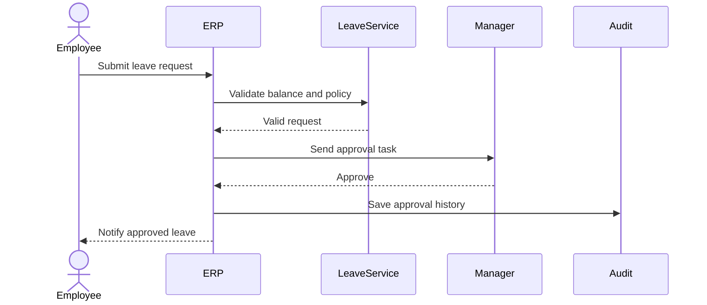

# Sequence Diagram

## Learning Objective
By the end of this lesson, you will document the order of messages between users, services, modules, and databases.

## What is Sequence Diagram?
A sequence diagram shows how participants communicate over time. It is excellent for approvals, integrations, login, payment, notifications, and background jobs.

## Why it is important?
ERP features often involve multiple modules. Sequence diagrams show who calls whom, which validations happen first, and where responses return.

## ERP Example
Leave approval starts with employee submission, validation by ERP, manager review, status update, and employee notification.

## Step-by-step Explanation
1. List participants from left to right.
2. Start with the initiating action.
3. Add validation calls.
4. Show success and failure responses.
5. Include notifications and audit logging.

## Diagram

## Key Points
- Time flows from top to bottom.
- Participants should be real roles or components.
- Responses are as important as requests.
- Alternative paths can show rejection or validation failure.

## Common Mistakes
- Adding too many low-level database calls.
- Skipping validation and failure paths.
- Using unclear participant names.
- Not showing asynchronous messages when they matter.

## Practice Task
Create a sequence diagram for purchase order approval including requester, ERP, manager, procurement, inventory, and finance.

## Summary
Sequence diagrams are powerful for explaining how ERP modules collaborate during one business transaction.
