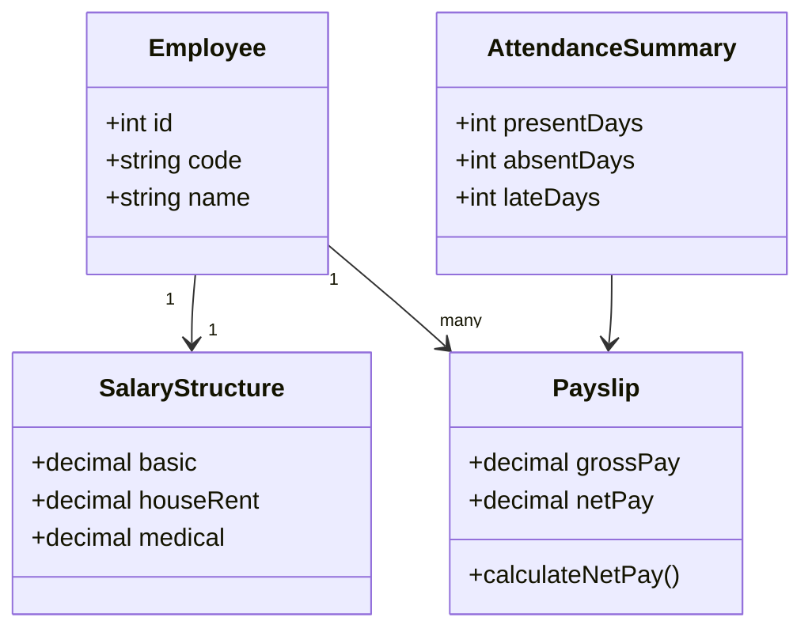

# Class Diagram

## Learning Objective
By the end of this lesson, you will model domain objects, attributes, behavior, and relationships for implementation planning.

## What is Class Diagram?
A class diagram shows classes, properties, methods, and relationships. It helps developers understand the business domain before writing code.

## Why it is important?
ERP logic is full of rules. Class diagrams help separate objects such as Employee, SalaryStructure, Payslip, Allowance, Deduction, and PayrollPolicy.

## ERP Example
Payroll calculation can be modeled with Employee, PayrollPolicy, SalaryStructure, AttendanceSummary, and Payslip classes.

## Step-by-step Explanation
1. Identify domain objects from requirements.
2. Add important attributes.
3. Add behavior as methods only when it belongs to the object.
4. Define inheritance, composition, or association.
5. Check whether the model explains business rules clearly.

## Diagram

## Key Points
- Class diagrams are not the same as ERDs.
- Methods should represent behavior, not database columns.
- Associations show how objects collaborate.
- Keep business language visible.

## Common Mistakes
- Turning every database table into a class without thinking.
- Adding getters and setters instead of business behavior.
- Ignoring value objects such as Money or DateRange.
- Making one huge class for an entire module.

## Practice Task
Design a class diagram for inventory stock issue with Item, Warehouse, StockLedger, IssueRequest, and ApprovalPolicy.

## Summary
Class diagrams help bridge requirements and code by modeling business behavior in objects.
