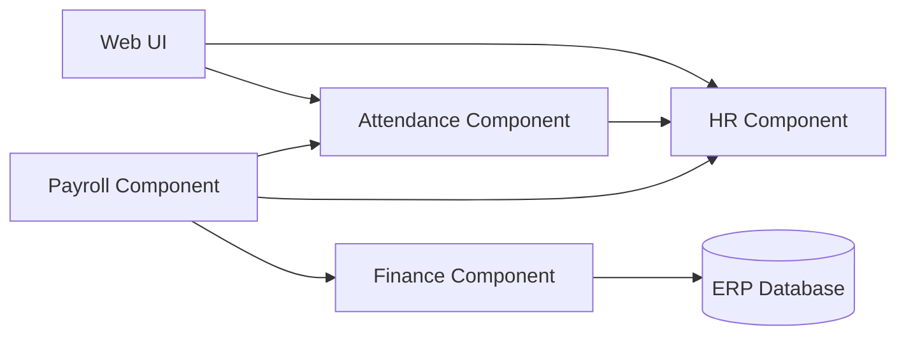

# Component Diagram

## Learning Objective
By the end of this lesson, you will show software modules, dependencies, and integration boundaries.

## What is Component Diagram?
A component diagram explains larger building blocks of a system and how they depend on each other. Components may be modules, services, libraries, UI apps, or external systems.

## Why it is important?
ERP solutions need clear module boundaries. Component diagrams show which module owns which capability and which dependencies must be managed carefully.

## ERP Example
HR owns employee master data. Attendance depends on HR. Payroll depends on HR, Attendance, and Finance posting rules.

## Step-by-step Explanation
1. List major modules or services.
2. Define ownership for each component.
3. Draw dependencies between components.
4. Mark external systems separately.
5. Avoid circular dependencies where possible.

## Diagram

## Key Points
- Components are larger than classes.
- Dependencies show architectural risk.
- A module should own its business rules.
- External systems should be visible.

## Common Mistakes
- Drawing screens instead of components.
- Hiding shared database dependencies.
- Allowing every module to depend on every other module.
- Not documenting integration contracts.

## Practice Task
Create a component diagram for Sales, Inventory, Finance, Reporting, and Notification modules.

## Summary
Component diagrams prepare you for clean module design and enterprise architecture discussions.
