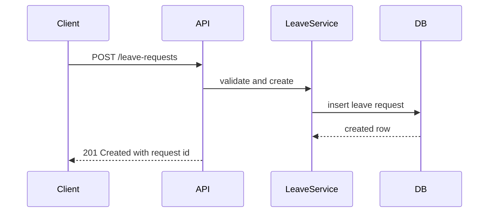

# REST API Design

## Learning Objective
By the end of this lesson, you will design predictable HTTP APIs using resources, methods, status codes, and contracts.

## What is REST API Design?
REST API design organizes endpoints around resources such as employees, invoices, items, or leave requests. It uses HTTP methods to express operations.

## Why it is important?
ERP APIs are consumed by mobile apps, integrations, reporting tools, and other services. A consistent API reduces integration bugs.

## ERP Example
Leave requests can use GET /leave-requests, POST /leave-requests, GET /leave-requests/{id}, and PATCH /leave-requests/{id}/status.

## Step-by-step Explanation
1. Name resources with nouns.
2. Use HTTP methods consistently.
3. Define request and response schemas.
4. Use meaningful status codes.
5. Document pagination, filtering, validation, and permissions.

## Diagram

## Key Points
- Resources should be nouns.
- Use status codes intentionally.
- Validation errors need field-level details.
- APIs should be versioned before external use.

## Common Mistakes
- Using /getEmployee and /saveEmployee style endpoints everywhere.
- Returning 200 for every error.
- Not documenting authentication and authorization.
- Changing response fields without versioning.

## Practice Task
Design REST endpoints for Item, Stock Transfer, and Stock Adjustment resources.

## Summary
Good REST design makes ERP integrations easier to understand, test, and maintain.
