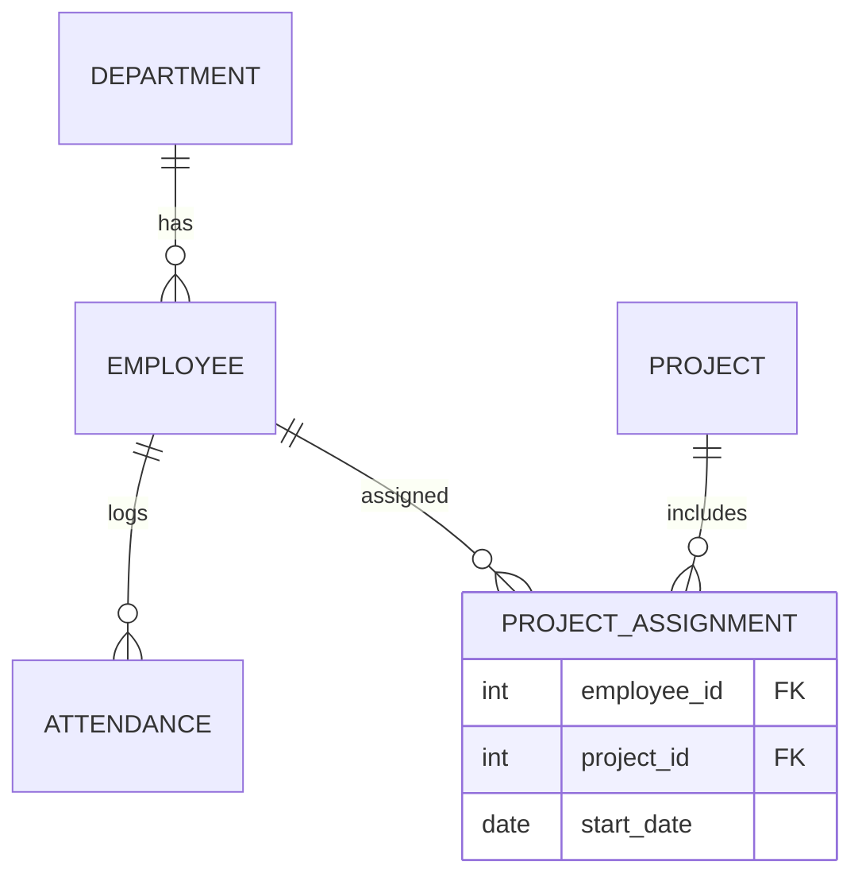

# Database Relationship

## Learning Objective
By the end of this lesson, you will use one-to-one, one-to-many, and many-to-many relationships correctly.

## What is Database Relationship?
Database relationships define how records connect. The three common patterns are one-to-one, one-to-many, and many-to-many.

## Why it is important?
ERP data must remain consistent across modules. Incorrect relationships create duplicate records, wrong reports, and difficult migrations.

## ERP Example
One Department has many Employees. One Employee has many Attendance rows. Employees and Projects can be many-to-many through ProjectAssignment.

## Step-by-step Explanation
1. Find the parent and child records.
2. Choose cardinality based on business rules.
3. Use foreign keys for one-to-many.
4. Use bridge tables for many-to-many.
5. Add constraints to prevent invalid data.

## Diagram

## Key Points
- One-to-many is the most common ERP relationship.
- Many-to-many needs a bridge table.
- Foreign keys preserve referential integrity.
- Relationship rules should match business reality.

## Common Mistakes
- Storing comma-separated IDs in one column.
- Using duplicate master records.
- Forgetting effective dates for changing assignments.
- Deleting parent records without considering child records.

## Practice Task
Model relationships for Supplier, Purchase Order, Purchase Order Item, Item, Goods Receive, and Invoice.

## Summary
Database relationships are the backbone of accurate ERP transactions and reporting.
