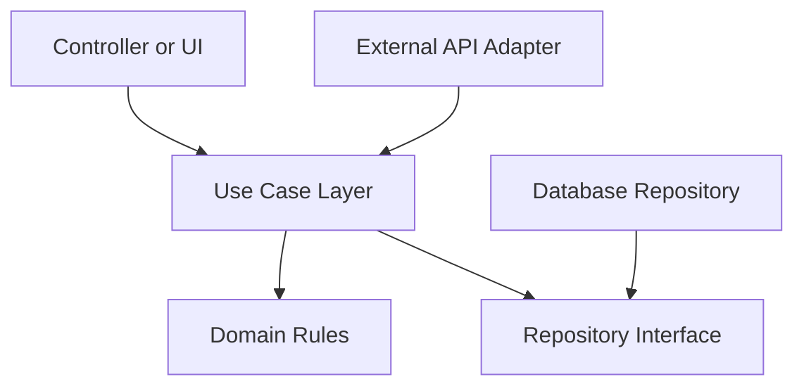

# Clean Architecture

## Learning Objective
By the end of this lesson, you will separate business rules from UI, database, framework, and external service details.

## What is Clean Architecture?
Clean Architecture organizes code so the domain and use cases do not depend on infrastructure. Outer layers can change without rewriting core business rules.

## Why it is important?
ERP business rules live for years, but frameworks, databases, and UI designs change. Clean boundaries make large systems easier to test and maintain.

## ERP Example
Payroll calculation rules should not depend directly on a web controller or SQL query. The use case should call interfaces that infrastructure implements.

## Step-by-step Explanation
1. Put business entities in the domain layer.
2. Put application workflows in use cases.
3. Define repository interfaces near use cases.
4. Implement database and external services in infrastructure.
5. Keep controllers thin.

## Diagram

## Key Points
- Dependencies point inward.
- Business rules should be testable without the database.
- Interfaces protect the core from infrastructure changes.
- Use cases express application behavior.

## Common Mistakes
- Putting business rules in controllers.
- Letting domain objects depend on frameworks.
- Creating too many layers for simple features.
- Using architecture names without enforcing boundaries.

## Practice Task
Design clean architecture folders for a leave approval module and list what belongs in each layer.

## Summary
Clean Architecture is a practical way to protect ERP business logic from technical churn.
