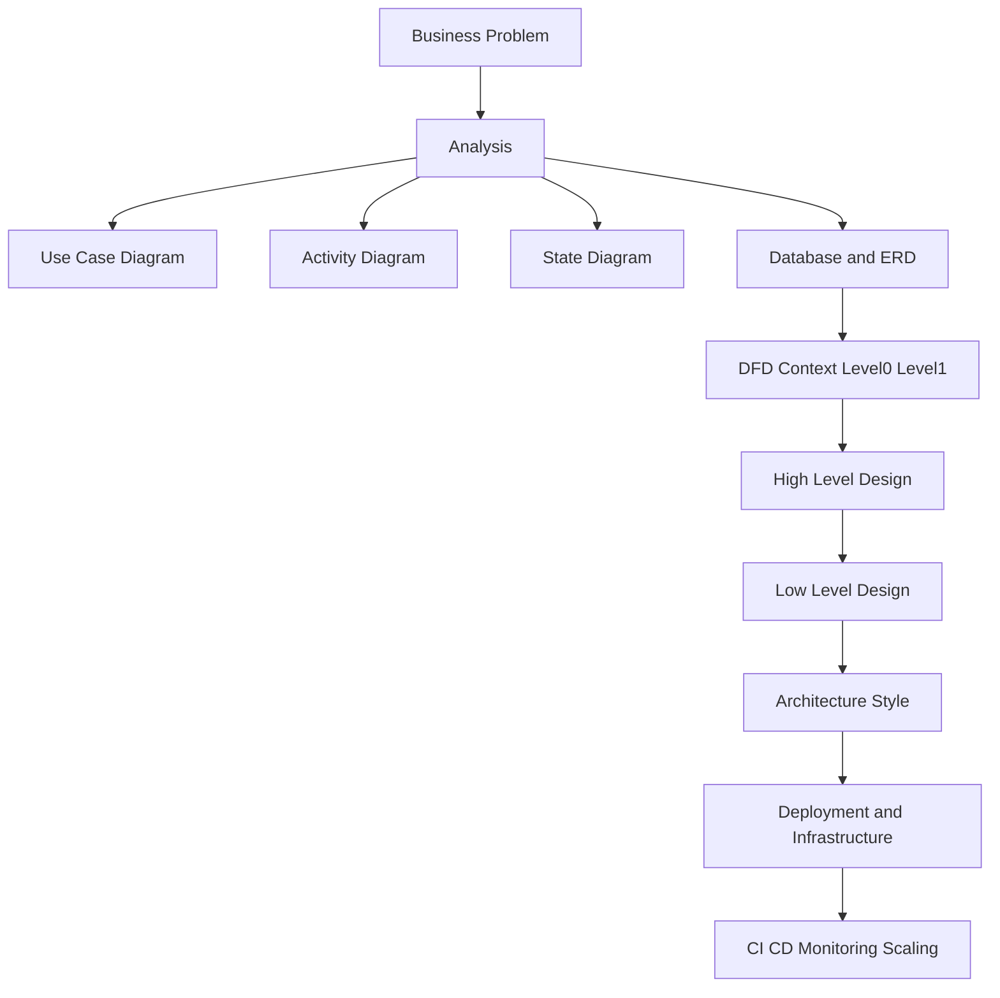

# Senior System Design Foundations

## Learning Objective
By the end of this lesson, you will understand how a senior software developer thinks before drawing any diagram: define scope, ask the right questions, separate facts from assumptions, choose the correct design artifacts, and connect business requirements to architecture decisions.

## What is Senior System Design?
Senior system design is the disciplined process of turning a business problem into a reliable, secure, scalable, maintainable, and understandable software solution.

It is not only drawing architecture boxes. It includes:
- Requirements analysis
- Data modeling
- Process modeling
- API and integration design
- High Level Design
- Low Level Design
- Deployment and infrastructure planning
- Risk analysis
- Tradeoff documentation
- Review and improvement

## Senior Developer Mindset
A junior developer often asks, "How do I code this feature?"

A senior developer asks:
- What problem are we solving?
- Who uses the system?
- What are the critical workflows?
- What data must be protected?
- What can fail?
- What must scale first?
- What should stay simple?
- What should be documented for future teams?

## Core Design Questions
Before creating diagrams, answer these questions:

1. What is the business goal?
2. Who are the actors?
3. What are the main use cases?
4. What data enters and leaves the system?
5. What data must be stored?
6. What are the main modules or services?
7. What are the non-functional requirements?
8. What external systems are involved?
9. What are the main risks?
10. What decisions need proof or review?

## Functional vs Non-Functional Requirements
Functional requirements describe what the system does.

Examples:
- Student can enroll in a course.
- Admin can publish lessons.
- Instructor can review assignments.
- System can generate invoices.

Non-functional requirements describe how well the system must work.

Examples:
- Handle 10,000 active users.
- Keep course videos available 99.9% of the time.
- Encrypt sensitive user data.
- Generate reports within 5 seconds.
- Recover from deployment failure within 10 minutes.

## System Design Learning Map

## Diagram Selection Guide
Use the right diagram for the question.

| Question | Best Artifact |
| --- | --- |
| Who uses the system? | Use Case Diagram |
| What steps happen in a business process? | Activity Diagram |
| What states can an object have? | State Diagram |
| What data exists and how is it related? | ERD and Schema |
| How does data move across the system? | DFD |
| How do components talk in one scenario? | Sequence Diagram |
| What are the major modules and integrations? | HLD |
| How will developers implement a module? | LLD |
| How is the system deployed? | Deployment and Infrastructure Diagrams |

## Running Example
This senior track uses one running example: a Learning Management and ERP Platform.

The platform includes:
- User registration and login
- Course catalog
- Course enrollment
- Payment and invoice generation
- Lesson progress tracking
- Assignment submission
- Instructor review
- Admin reporting
- Notifications
- Deployment to cloud infrastructure

This example is useful because it has users, workflows, data, payments, reporting, async events, scaling, and infrastructure concerns.

## Step-by-Step Design Process
1. Define scope and users.
2. Write main use cases.
3. Model key workflows.
4. Identify entities and relationships.
5. Design database schema.
6. Normalize and review data ownership.
7. Draw data flow diagrams.
8. Draw sequence diagrams for important scenarios.
9. Prepare HLD with modules, integrations, storage, and deployment.
10. Prepare LLD for selected modules.
11. Choose architecture style.
12. Design deployment, network, load balancing, containers, and CI/CD.
13. Review risks and tradeoffs.
14. Create a final design document.

## Senior-Level Tradeoffs
- Start simple, but document where scale pressure will appear.
- Prefer clear module boundaries before choosing microservices.
- Do not design infrastructure before understanding traffic and failure needs.
- Do not design database tables before understanding business rules.
- Do not hide assumptions. Assumptions are design risks.

## Common Mistakes
- Drawing architecture before requirements.
- Confusing screens with business capabilities.
- Creating too many diagrams without a decision behind them.
- Using microservices to solve unclear boundaries.
- Ignoring failure paths, retries, and data consistency.
- Treating HLD and LLD as the same document.

## Senior Design Checklist
- Scope is clear.
- Actors are named.
- Use cases are prioritized.
- Data model is reviewed.
- Critical workflows have sequence or activity diagrams.
- HLD explains modules and deployment.
- LLD explains implementation details.
- Security, scale, reliability, and observability are included.
- Tradeoffs and alternatives are documented.
- Open questions are visible.

## Practice Task
Choose one system: e-commerce, hospital management, inventory, payroll, or learning platform. Write:
- Goal
- Actors
- Top 5 use cases
- Top 5 entities
- Top 3 non-functional requirements
- Main risks

## Interview and Design Review Questions
- What problem is your design solving?
- Which assumptions can break the design?
- Why did you choose this architecture?
- What is the simplest version that can work?
- What will you change if traffic grows 10x?
- What data must be consistent immediately?
- What can be eventually consistent?

## Summary
Senior system design is a repeatable thinking process. Diagrams are tools, not the goal. The goal is to make decisions visible, testable, and understandable for developers, reviewers, and business stakeholders.
