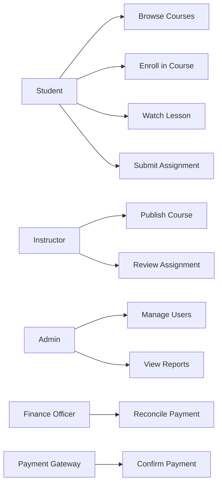

# Analysis and Use Case Design

## Learning Objective
By the end of this lesson, you will analyze a software problem, identify actors, define system boundaries, write use cases, and create a use case diagram that guides later database, DFD, HLD, and LLD work.

## What is Analysis?
Analysis is the process of understanding the business problem before designing the technical solution.

Good analysis answers:
- Who needs the system?
- What goals do they have?
- What is inside the system boundary?
- What is outside the system boundary?
- What business rules must be followed?
- What is the priority of each feature?

## Why Senior Developers Care
Senior developers use analysis to prevent wrong architecture. A beautiful architecture for the wrong problem is still a failed design.

Analysis reduces:
- Misunderstood requirements
- Missing actors
- Incorrect database entities
- Wrong integration boundaries
- Over-engineered infrastructure
- Scope creep

## Actors
An actor is a person, organization, device, or external system that interacts with your software.

For a Learning Management and ERP Platform:
- Student
- Instructor
- Admin
- Finance Officer
- Payment Gateway
- Email Service
- Reporting System

## System Boundary
The system boundary shows what your software owns.

Inside the boundary:
- Course management
- Enrollment
- Progress tracking
- Assignment review
- Invoice generation

Outside the boundary:
- Payment gateway authorization
- Email delivery
- External identity provider
- Bank settlement

## Use Case Diagram
A use case diagram shows actors and the goals they perform with the system.

## Use Case Description Template
For each important use case, write:
- Name
- Primary actor
- Goal
- Trigger
- Preconditions
- Main success flow
- Alternative flows
- Failure flows
- Business rules
- Data created or changed
- Non-functional concerns

## Example Use Case: Enroll in Course
Name: Enroll in Course

Primary actor: Student

Goal: Student buys or joins a course and receives access.

Trigger: Student clicks Enroll.

Preconditions:
- Student is logged in.
- Course is published.
- Course has available access policy.

Main success flow:
1. Student opens course page.
2. System checks enrollment eligibility.
3. Student chooses payment method.
4. System creates enrollment request.
5. Payment gateway confirms payment.
6. System activates enrollment.
7. System generates invoice.
8. System sends confirmation notification.

Alternative flows:
- Free course skips payment.
- Coupon changes final price.
- Organization subscription grants access.

Failure flows:
- Payment fails.
- Course is unpublished during checkout.
- Student account is blocked.

Business rules:
- One active enrollment per student per course.
- Paid enrollment is active only after successful payment.
- Invoice number must be unique.

## Analysis to Design Mapping

| Analysis Output | Later Design Artifact |
| --- | --- |
| Actor | Use Case, DFD external entity, security role |
| Use case | Activity diagram, sequence diagram, API contract |
| Business rule | Database constraint, domain service, validation |
| Data created | ERD entity, schema table |
| External actor | Integration boundary, API gateway route |
| Failure flow | LLD error handling, retry strategy |

## Step-by-Step Process
1. Interview stakeholders.
2. List actors.
3. List actor goals.
4. Separate must-have and optional goals.
5. Draw system boundary.
6. Create use case diagram.
7. Write descriptions for high-value use cases.
8. Mark business rules.
9. Mark data changes.
10. Review with users and developers.

## Senior-Level Tradeoffs
- Too many use cases make the diagram unreadable. Keep the diagram high level, then write detailed use case descriptions separately.
- Do not model every button click as a use case. Use cases represent user goals.
- Keep external systems as actors when they initiate or receive important interactions.
- Use analysis to identify security roles early.

## Common Mistakes
- Treating screens as use cases.
- Missing external systems.
- Not defining the system boundary.
- Ignoring failure flows.
- Skipping business rules.
- Jumping to database design too early.

## Analysis Checklist
- Every actor has at least one goal.
- Every major goal has a use case.
- System boundary is clear.
- External systems are visible.
- Critical use cases have written flows.
- Business rules are documented.
- Data changes are identified.
- Security roles are known.

## Practice Task
For an inventory system, create:
- Actors: warehouse staff, manager, supplier, purchasing system
- Use cases: receive stock, issue stock, adjust stock, reorder item, view stock report
- One use case description for receive stock

## Interview and Design Review Questions
- Which actor has the highest business value?
- What is outside your system boundary?
- Which use case creates the most important data?
- Which use case has the most risk?
- Which use case must work even under high traffic?

## Summary
Analysis and use case design convert unclear business needs into structured goals. This becomes the starting point for workflow diagrams, ERDs, DFDs, APIs, HLD, and LLD.
