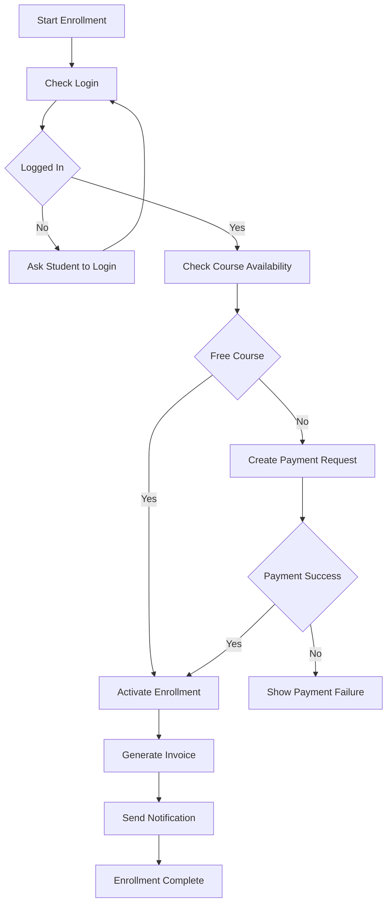
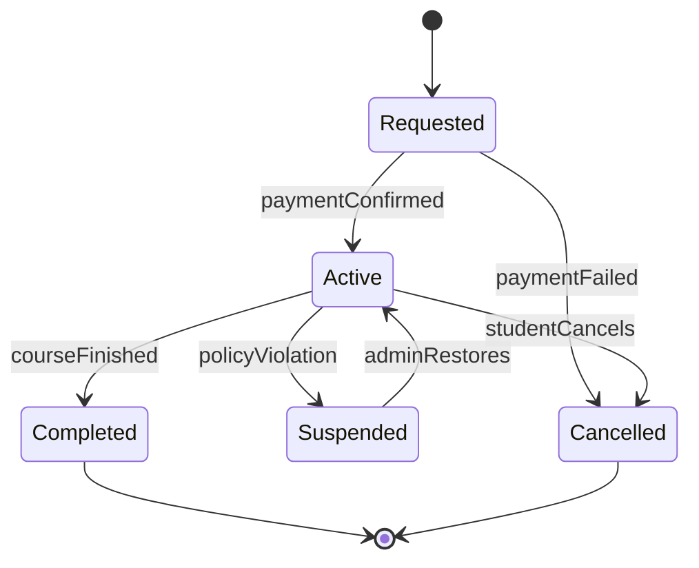

# Activity, State, and Workflow Diagrams

## Learning Objective
By the end of this lesson, you will model business workflows with activity diagrams, model lifecycle behavior with state diagrams, and understand when each diagram should be used in senior software design.

## Why Workflow Diagrams Matter
Use cases tell what users want. Activity and state diagrams explain how the work happens.

Senior developers use these diagrams to discover:
- Missing validation steps
- Approval rules
- Parallel actions
- Failure branches
- State transitions
- Background jobs
- Audit requirements

## Activity Diagram
An activity diagram shows step-by-step behavior in a process. It is best for workflows such as enrollment, approval, checkout, payroll processing, order fulfillment, or ticket resolution.

## Activity Diagram Example: Course Enrollment

## Activity Diagram Creation Process
1. Start from one use case.
2. Write the happy path.
3. Add decisions.
4. Add failure paths.
5. Add parallel work if needed.
6. Mark external system calls.
7. Mark data creation or update points.
8. Review with business users.

## State Diagram
A state diagram shows how one object changes over time. It is best for entities with lifecycle rules.

Examples:
- Order: Draft, Submitted, Paid, Shipped, Delivered, Cancelled
- Payment: Pending, Authorized, Captured, Failed, Refunded
- Enrollment: Requested, Active, Suspended, Completed, Cancelled
- Ticket: Open, Assigned, In Progress, Resolved, Closed

## State Diagram Example: Enrollment Lifecycle

## Difference Between Activity and State

| Diagram | Focus | Best For |
| --- | --- | --- |
| Activity Diagram | Process steps | Workflow, approval, checkout, onboarding |
| State Diagram | Object lifecycle | Payment status, order status, enrollment status |
| Sequence Diagram | Message order | API calls and component interaction |

## Workflow Analysis Questions
Ask these before drawing:
- What starts the workflow?
- What completes the workflow?
- Which steps are manual?
- Which steps are automated?
- Which steps call external systems?
- What data changes at each step?
- What can fail?
- Which steps need audit logs?
- Which steps require permission checks?

## Senior-Level Design Notes
Activity diagrams often expose missing modules. For example, if enrollment requires payment, invoice, notification, and reporting, the architecture may need separate payment, billing, notification, and analytics components.

State diagrams often expose missing database fields. For example, an Enrollment table may need:
- status
- activated_at
- completed_at
- cancelled_at
- cancellation_reason
- version for concurrency control

## Common Mistakes
- Drawing only the happy path.
- Mixing object state with process steps.
- Ignoring failed external calls.
- Not showing who performs manual approval.
- Forgetting audit and rollback needs.
- Creating too much detail in one diagram.

## Checklist
- One workflow per activity diagram.
- One object lifecycle per state diagram.
- Start and end points are clear.
- Decisions have clear labels.
- Failure states are included.
- Important data changes are visible.
- Business rules are linked to steps or transitions.

## Practice Task
Create an activity diagram and state diagram for an invoice approval system.

Activity diagram should include:
- Create invoice
- Validate invoice
- Manager approval
- Finance approval
- Payment scheduling
- Rejection path

State diagram should include:
- Draft
- Submitted
- Approved
- Rejected
- Paid
- Cancelled

## Interview and Design Review Questions
- Which state transitions require permission?
- Can the same transition happen twice?
- What happens if payment succeeds but notification fails?
- Which workflow steps must be transactional?
- Which steps can run asynchronously?

## Summary
Activity diagrams explain process flow. State diagrams explain object lifecycle. Together they help senior developers find missing rules, data fields, modules, and failure paths before implementation starts.
