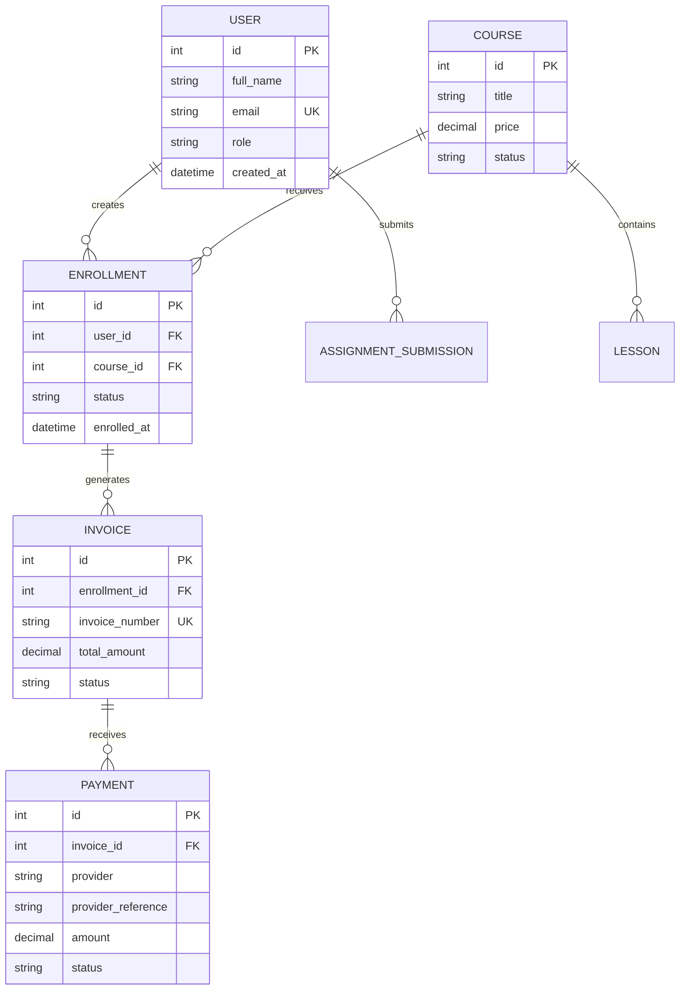
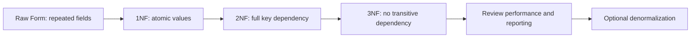

# Database, ERD, Schema, Relationship, and Normalization

## Learning Objective
By the end of this lesson, you will design a database from business requirements using ERD, relationship diagrams, schema design, normalization, constraints, indexes, and senior-level data tradeoffs.

## Why Database Design Comes Early
Most software systems are data systems. If the data model is wrong, the API, HLD, LLD, reporting, and scaling design will become difficult.

Senior developers design data carefully because data usually lives longer than application code.

## Database Design Concepts
Important concepts:
- Entity: business object such as Student, Course, Enrollment
- Attribute: data field such as name, email, price
- Primary key: unique identifier
- Foreign key: relationship reference
- Cardinality: one-to-one, one-to-many, many-to-many
- Constraint: rule enforced by the database
- Index: structure that improves lookup performance
- Transaction: group of changes that must succeed or fail together
- Normalization: reduce duplication and update anomalies
- Denormalization: duplicate selected data intentionally for performance or reporting

## ERD
An Entity Relationship Diagram shows entities, attributes, keys, and relationships.



## Relationship Diagram
A relationship diagram focuses on cardinality and ownership.

| Relationship | Meaning | Implementation |
| --- | --- | --- |
| User to Enrollment | One user can have many enrollments | `enrollments.user_id` |
| Course to Enrollment | One course can have many enrollments | `enrollments.course_id` |
| Course to Lesson | One course contains many lessons | `lessons.course_id` |
| Enrollment to Invoice | One enrollment can create invoices | `invoices.enrollment_id` |
| Invoice to Payment | One invoice can receive payment attempts | `payments.invoice_id` |

## Database Schema Example

```sql
CREATE TABLE users (
  id BIGINT PRIMARY KEY,
  full_name VARCHAR(120) NOT NULL,
  email VARCHAR(160) NOT NULL UNIQUE,
  role VARCHAR(40) NOT NULL,
  created_at TIMESTAMP NOT NULL
);

CREATE TABLE courses (
  id BIGINT PRIMARY KEY,
  title VARCHAR(200) NOT NULL,
  price DECIMAL(12, 2) NOT NULL,
  status VARCHAR(40) NOT NULL
);

CREATE TABLE enrollments (
  id BIGINT PRIMARY KEY,
  user_id BIGINT NOT NULL REFERENCES users(id),
  course_id BIGINT NOT NULL REFERENCES courses(id),
  status VARCHAR(40) NOT NULL,
  enrolled_at TIMESTAMP NOT NULL,
  UNIQUE (user_id, course_id)
);
```

## Normalization
Normalization organizes data to reduce duplication and prevent inconsistent updates.

### First Normal Form
Each field contains one value, not a list.

Bad:
`course_ids = "1,2,3"`

Good:
Use an `enrollments` table with one row per user-course relationship.

### Second Normal Form
Every non-key field depends on the whole key.

If an enrollment item table has `(user_id, course_id)` as a composite key, course title should not be stored there because it depends only on `course_id`.

### Third Normal Form
Non-key fields should not depend on other non-key fields.

Bad:
Store `department_name` inside `users` when it depends on `department_id`.

Good:
Store departments in a separate table and reference them.

## Normalization Diagram



## Denormalization
Denormalization is intentional duplication for performance or reporting.

Examples:
- Store `course_title_snapshot` on invoice items.
- Store daily aggregate counts in reporting tables.
- Store read models for dashboard queries.

Use denormalization only when:
- You know the query problem.
- You know the source of truth.
- You have a refresh/update strategy.
- You accept consistency tradeoffs.

## Senior-Level Tradeoffs
- Relational databases are strong for transactions and relationships.
- Document databases are useful for flexible nested data, but reporting and relationships can become harder.
- Normalized models reduce duplication but may need joins.
- Denormalized models improve reads but increase consistency risk.
- Indexes speed reads but slow writes and consume storage.
- Foreign keys protect integrity but require careful migration planning.

## Common Mistakes
- Designing tables from UI screens.
- Missing unique constraints.
- Using text status values without a controlled lifecycle.
- Ignoring audit columns.
- Storing calculated values without a source-of-truth policy.
- Not planning indexes for common queries.
- Over-normalizing simple data.
- Denormalizing too early.

## Database Design Checklist
- Entities come from business nouns.
- Every table has a primary key.
- Foreign keys match ownership rules.
- Cardinality is correct.
- Many-to-many relationships use bridge tables.
- Important uniqueness rules are enforced.
- Status fields match state diagrams.
- Audit fields are included.
- Indexes support common reads.
- Migration strategy is considered.
- Reporting needs are known.

## Practice Task
Design a database for an online course platform with:
- Users
- Courses
- Lessons
- Enrollments
- Payments
- Invoices
- Assignment submissions
- Reviews

Create:
- ERD
- Relationship table
- SQL schema for 5 tables
- Normalization notes
- 3 indexes with reasons

## Interview and Design Review Questions
- What is your source of truth for payment status?
- Which relationships must be protected by foreign keys?
- Which fields need unique constraints?
- Which queries need indexes?
- What data must be retained for audit?
- Where would denormalization be justified?

## Summary
Database design is the foundation of reliable software. ERD explains structure, schema enforces rules, relationship diagrams clarify ownership, and normalization protects long-term data quality.
